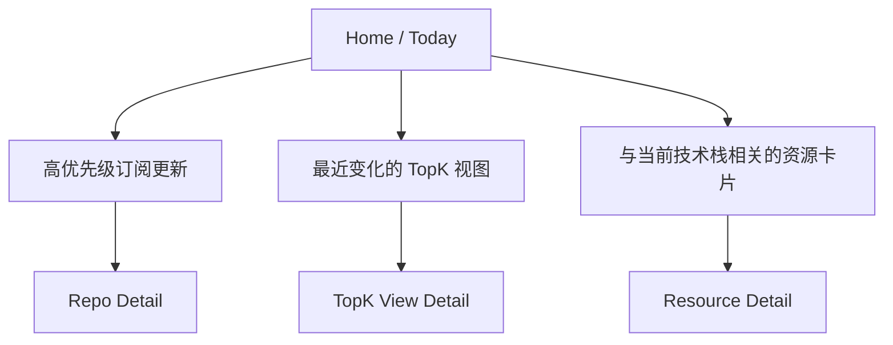
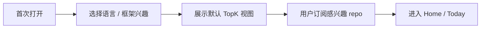
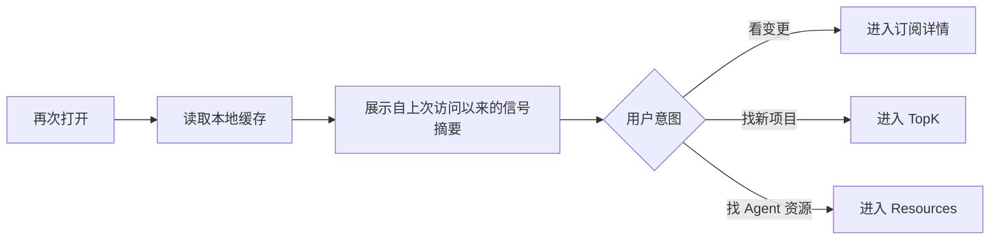

# 00. geek taste v1 设计母稿

状态：Draft for Build  
适用范围：v1 首发版本  
文档性质：母稿；定义产品的最小正确语义与实现方向。

---

## 1. 产品一句话定义

`geek taste` 是一个面向重度 GitHub 观察者与 AI coding 采用者的**跨端技术雷达工作台**：

- 用 **TopK 榜单**发现值得关注的新趋势；
- 用 **Repo 订阅**跟踪值得处理的可用更新；
- 用 **Agent 资源雷达**发现与当前语言/框架相关的 MCP / Skills / Agent 生产力资源。

该产品的核心输出不是“更多信息”，而是**高信噪比、可行动、低打扰的技术信号**。

---

## 2. 设计目标与非目标

### 2.1 设计目标

1. **让用户在 30 秒内完成判断**：今天有哪些仓库/资源值得看。
2. **降低长期跟踪成本**：用户无需手动刷大量 GitHub 页面。
3. **把探索和跟踪放进同一工作流**：从 TopK 发现项目，再一键转为订阅。
4. **保持高信息密度但低认知切换**：界面简洁，不等于信息稀薄。
5. **保持本地优先与性能可预测**：启动快，离线可读，弱网可退化。

### 2.2 非目标

v1 不追求以下目标：

1. 替代 GitHub 全站搜索。
2. 替代 GitHub Discussions / Issues / PR 审查工具。
3. 成为内容社区、媒体站或社交网络。
4. 提供实时秒级全仓库告警。
5. 覆盖所有非 GitHub 技术资源来源。

---

## 3. 核心用户定义

### 3.1 核心用户（首发 ICP）

**重度 GitHub 跟踪者 + AI coding 工具采用者**。

满足以下至少三项：

- 每周多次查看 GitHub 项目动态；
- 会按语言/框架趋势调整技术选型；
- 使用或尝试 Cursor / Claude Code / Windsurf / Cline / 自建 agent loop；
- 关心 MCP / Skills / Agent 工具链；
- 有一批长期关注的仓库，需要知道“什么时候真的值得看”。

### 3.2 次级用户（非首发主设计对象）

1. 普通开源浏览者；
2. 偶发性看榜单的轻度用户；
3. 企业治理场景中的组织管理员；
4. 只关注私有仓库内部协作流的团队成员。

这些用户可被兼容，但不主导 v1 的信息架构和默认行为。

---

## 4. 用户核心任务（Jobs-to-be-Done）

### JTBD-1：趋势发现

> “我想快速知道，在我关心的语言/框架里，最近哪些项目值得关注。”

成功条件：

- 用户能在 1 个页面内完成过滤、排序、浏览、订阅。
- 用户不需要理解复杂查询语言就能得到可靠结果。
- 结果默认不是噪声堆砌，而是能直接进入下一步（订阅 / 收藏 / 打开原仓库）。

### JTBD-2：目标仓库跟踪

> “我不想手动刷仓库页面，但我又不想错过真正有用的更新。”

成功条件：

- 用户能明确知道仓库发生的是哪一类更新；
- 默认只提醒“可用更新”，而非所有活动；
- 通知频率默认克制，支持 12h / 24h digest。

### JTBD-3：Agent 能力赋能

> “我想知道在当前语言/框架下，最近有哪些 MCP / Skills / Agent 资源值得看。”

成功条件：

- 用户无需在不同站点和关键词之间来回跳转；
- 资源是按技术栈和上下文相关的，而不是“全网 agent 资源大杂烩”；
- 发现之后能直接进入仓库、文档或后续收藏流程。

---

## 5. 产品论证（Why this product exists）

### 5.1 市场层面的缺口

现有工具通常只满足单一任务：

- GitHub 本体：适合单仓库深挖，不适合持续跨项目雷达；
- 各类趋势站：适合“逛”，不适合“跟”；
- RSS / 通知工具：适合事件推送，不适合技术筛选；
- AI 工具目录：适合堆资源，不适合结合语言/框架上下文。

`geek taste` 的价值在于把**发现 -> 跟踪 -> 行动**放到一条闭环中。

### 5.2 设计裁决

v1 的设计中心必须是：

- **Signal over Feed**：信号优先，而不是无限流。
- **Actionability over Completeness**：可行动优先，而不是全量覆盖。
- **Defaults over Configuration Explosion**：强默认优先，而不是初期过度可配置。
- **Desktop-first Workbench over Website-first Portal**：工作台优先，而不是资讯站优先。

---

## 6. v1 功能面定义

### 6.1 一级功能

1. **今日摘要（Today）**
   - 聚合上次访问以来的高优先级信号。
   - 是首页默认重点区域。

2. **TopK 榜单（TopK Views）**
   - 按语言、框架、主题、时间窗进行发现。
   - 支持多种排序视图：`Popular`、`Recently Updated`、`Momentum`。

3. **我的订阅（Subscriptions）**
   - 用户维护自己关心的 repo 列表。
   - 默认只跟踪可用更新级别的变化。

4. **资源专题榜（Resource Radar）**
   - 按语言/框架呈现与 code agent 生产力相关的 GitHub 资源。
   - 以专题榜和相关推荐的方式呈现，不独立发展成内容平台。

5. **通知与规则（Rules）**
   - 配置 digest 窗口、优先级、是否开启桌面提醒、安静时段等。

### 6.2 首页信息架构

首页不是“把所有模块平铺”。首页的职责只有两个：

1. 告诉用户自上次访问以来发生了什么；
2. 给用户一个最快的下一步动作入口。

建议结构：

---

## 7. v1 信息架构

### 7.1 导航

- Home
- TopK
- Subscriptions
- Resources
- Rules / Settings

### 7.2 页面意图定义

| 页面 | 页面存在的唯一理由 |
|---|---|
| Home | 帮用户快速判断今天先看什么 |
| TopK | 帮用户发现新机会和新项目 |
| Subscriptions | 帮用户持续跟踪既有关注对象 |
| Resources | 帮用户发现与 agent 提效相关的资源 |
| Rules | 帮用户控制频率、噪音和默认行为 |

---

## 8. 核心交互流

### 8.1 冷启动流

裁决：

- 首次冷启动**不应**强迫用户先配置大量订阅。
- 冷启动阶段必须先让 TopK 提供即时价值。
- 订阅行为是“发现后转跟踪”的二级留存机制。

### 8.2 回访流

### 8.3 订阅创建流

- 入口 1：从 TopK item 一键订阅。
- 入口 2：手动搜索仓库并订阅。
- 入口 3：从 Resource 详情页跳到其源仓库并订阅。

订阅默认值：

- 事件类型：`RELEASE_PUBLISHED`, `TAG_PUBLISHED`, `DEFAULT_BRANCH_ACTIVITY_DIGEST`
- digest：24h
- 桌面推送：仅 High Priority

---

## 9. 产品对象模型（概念层）

`geek taste` 在概念上只有五种核心对象：

1. **Repository**：GitHub 仓库。
2. **Subscription**：用户对 Repository 的跟踪关系。
3. **Signal**：一次经过归一化后值得展示或提醒的变化。
4. **RankingView**：一个可重复、可缓存、可比较的榜单视图。
5. **Resource**：与 code agent 生产力相关的 GitHub 资源对象。

所有页面都应围绕这五类对象展开，禁止再发明新的“隐性主对象”。

---

## 10. v1 成功判据

### 10.1 产品层成功判据

至少满足以下四条中的三条：

1. 用户首次会话中，能在 3 分钟内建立至少 1 个订阅或保存 1 个 TopK 视图。
2. 用户回访时，能在 30 秒内识别 1 个值得打开的信号。
3. 用户对默认通知频率的主观反馈是“够用、不吵”。
4. 用户能够把 TopK 视图中的项目转为长期订阅，而不是只短暂浏览。

### 10.2 工程层成功判据

1. 应用可离线打开并展示上次同步缓存。
2. 同步逻辑可中断、可恢复、可幂等。
3. 关键术语、状态、枚举在前后端和数据库中语义一致。
4. 所有高优先级通知都能溯源到一个明确的 `Signal` 对象。

---

## 11. v1 明确不做的东西

1. 实时秒级仓库事件流。
2. GitHub 全量 issue/discussion 订阅中心。
3. 用户间共享、评论、点赞、协作。
4. 全自动 LLM 生成摘要作为核心路径依赖。
5. 覆盖 npm / crates / PyPI / docs 网站等多源异构爬取。
6. Web-first 的开放内容门户。
7. 一上来做“所有开发者都能用”的全能产品。

---

## 12. 首版技术与交付裁决

### 12.1 客户端形态裁决

v1 以**桌面优先**为原则，原因：

1. 本地缓存与离线能力更自然；
2. GitHub token 单机安全管理更可控；
3. 桌面通知、后台轮询、批量缓存更符合使用场景；
4. Tauri + SvelteKit 组合在桌面上最稳。[R1][R2]

### 12.2 数据源裁决

v1 的主数据源是 GitHub API 与 GitHub 仓库元数据。

`Resource Radar` 亦以 GitHub 为主源；其他来源只允许通过后续扩展引入。

### 12.3 排行榜裁决

`TopK` 在 v1 中是**产品定义的排行榜语义**，不是“GitHub Trending 的接口映射”。

- [核验] GitHub 官方 Search API 提供 repository search 及多种排序，但当前核验资料未发现一个可直接作为官方 Trending API 的公开 REST endpoint。[R3][推断]
- 因此本产品的 TopK 必须由**查询模板 + 过滤器 + 快照 + 评分公式**定义。

---

## 13. UI / UX 原则（不含生成提示词）

### 13.1 视觉原则

1. **Dense but calm**：高密度但不压迫。
2. **Keyboard-first**：重度用户应能快速筛选和跳转。
3. **State-visible**：已读、未读、订阅、缓存状态必须显式可见。
4. **Source-traceable**：任何信号都必须可以打开原始 GitHub 来源。
5. **Low-motion**：避免视觉噪声与过度动效。

### 13.2 交互原则

1. 默认排序必须可信。
2. 筛选器必须可组合，但不可过载。
3. 任何榜单项都必须支持“一步订阅”。
4. 任何订阅项都必须支持“查看变更依据”。
5. 任何资源项都必须解释“为什么推荐给我”。

---

## 14. 设计冻结条件

以下条件成立时，v1 母稿可视为冻结：

1. `01_p0_domain_language_spec.md` 中的所有 P0 术语已经不再歧义；
2. `02_v1_scope_boundaries_assumptions_antipatterns.md` 中的非目标与边界已获团队认可；
3. `03` 至 `07` 中的实现与验收约束已经闭环；
4. 没有任何关键流程依赖“后面再说”的未定义语义。

---

## 15. 母稿摘要

v1 的真正难点不是“把 GitHub 数据拉下来”，而是：

- 定义什么值得提醒；
- 定义什么算趋势；
- 定义资源与技术栈的相关性；
- 把三条能力线收敛到一套清晰、低噪音、可实现的对象模型中。

因此，**信号语义、边界控制、缓存策略、默认值设计**比“堆更多接口”更重要。
