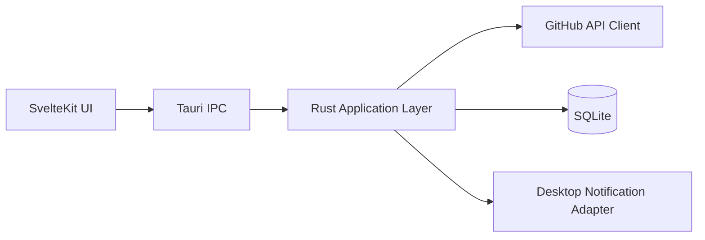
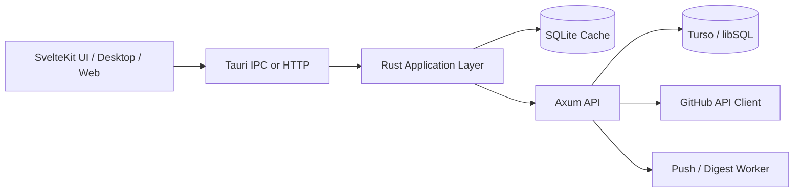

# 03. 系统架构规范

状态：Normative  
优先级：P0 / P1  
目标：给架构师与工程师一套足够稳定、可实现、可渐进演化的系统骨架。

---

## 1. 架构目标

系统架构必须同时满足以下目标：

1. **本地优先**：无网可打开，缓存可读。
2. **低打扰**：同步、通知、榜单更新都必须可控。
3. **可渐进升级**：先单机，后云增强，不推翻客户端架构。
4. **语义集中**：域模型统一，不允许前后端各自定义。
5. **速率预算可控**：把 GitHub API 当成受限资源，而不是无限源。

---

## 2. 总体架构结论

### 2.1 v1 推荐形态

**桌面本地优先架构**：

- Shell：`Tauri`
- UI：`SvelteKit (SPA via static-adapter)`
- Domain / Application / Infra：`Rust`
- Local DB：`SQLite`
- Optional later backend：`Axum + Turso`

### 2.2 为什么这样设计

#### [核验] Tauri 是 Rust + OS WebView 的桌面应用工具链

Tauri 官方架构文档说明，其核心是 Rust 工具与 WebView 中渲染的 HTML 组合，WebView 和 Rust 通过消息传递互通。[R1]

含义：

- 前端可以保留 Web 技术生产力；
- 性能敏感、调度、数据、系统能力放在 Rust 侧更稳；
- 非常适合桌面工作台型应用。

#### [核验] Tauri + SvelteKit 必须使用 static-adapter / SPA 思路

官方指南指出 Tauri 不支持 server-based frontend solution，推荐 `static-adapter`，且在有 prerender 时，build 阶段的 `load` 不可访问 Tauri API。[R2]

架构裁决：

- SvelteKit 只承担 UI 与 view model；
- 业务核心、缓存与同步逻辑 MUST 在 Rust 侧；
- 前端不得依赖 SvelteKit server runtime 实现核心业务。

---

## 3. 部署模式

### 3.1 Mode A：Local-first（v1 默认）

适用：

- 单机使用；
- 主要跟踪公开仓库；
- 不需要跨设备同步；
- 需要最快的首版闭环。



特征：

- GitHub token 仅存于本机安全存储；
- 所有信号、快照、规则、已读状态存本地；
- 轮询和 digest 在本机完成。

### 3.2 Mode B：Cloud-enhanced（v1.1+ 可选）

适用：

- 需要跨设备同步；
- 需要 Web 伴生端；
- 需要服务端定时拉取与统一推送；
- 需要团队版或共享视图。



裁决：

- v1 不要求 Mode B；
- 但 v1 的域模型和模块边界必须允许平滑迁移到 Mode B。

---

## 4. 分层架构

推荐采用四层模型：

1. **Presentation Layer**
2. **Application Layer**
3. **Domain Layer**
4. **Infrastructure Layer**

### 4.1 Presentation Layer

实现位置：SvelteKit + Tauri UI binding

职责：

- 呈现列表、详情、过滤器、状态；
- 处理用户输入与路由；
- 调用 application commands；
- 不包含 GitHub API 语义与持久化规则。

禁止：

- 在前端自行定义 `SignalType` 文案枚举作为权威来源；
- 在前端实现排名主公式；
- 在前端直接拼复杂 GitHub 查询作为唯一事实源。

### 4.2 Application Layer

实现位置：Rust

职责：

- 编排用例：同步、创建订阅、生成摘要、保存榜单视图、资源重评分；
- 应用策略与权限；
- 调用 domain services 和 infrastructure adapters。

典型用例：

- `sync_subscriptions()`
- `refresh_ranking_view()`
- `generate_digest()`
- `upsert_subscription()`
- `ack_signal()`

### 4.3 Domain Layer

实现位置：Rust

职责：

- 定义实体、值对象、状态机、评分规则接口；
- 保持纯语义，不依赖 HTTP/SQLite/Tauri。

典型对象：

- `Repository`
- `Subscription`
- `Signal`
- `RankingView`
- `RankingSnapshot`
- `Resource`
- `Digest`

### 4.4 Infrastructure Layer

实现位置：Rust

职责：

- GitHub API adapter
- SQLite repository
- optional Turso adapter
- scheduler / retry / backoff
- notification adapter
- secure secret storage

---

## 5. 模块边界建议

建议 Cargo workspace 结构：

```text
/geek-taste
  /apps
    /desktop-ui           # SvelteKit + Tauri frontend shell
  /crates
    /domain               # 纯领域对象与规则
    /application          # 用例编排
    /github_adapter       # GitHub REST client + mapping
    /persistence_sqlite   # SQLite repository impl
    /notification_adapter # 桌面通知
    /runtime_tauri        # Tauri commands / bootstrap
    /runtime_server       # Axum (future)
    /shared_contracts     # JSON schema / DTO / enum export
  /docs
```

原则：

- 域模型在 Rust 侧唯一权威定义；
- TS 类型 SHOULD 由 Rust schema/contract 生成，而不是手写并长期漂移；
- UI 层只消费 contract，不反向定义 domain semantics。

---

## 6. GitHub 集成架构

### 6.1 API 策略

v1 采用 **REST-first**。

原因：

1. Search / Releases / Tags / Topics / Repo metadata / Events 均有清晰 REST 支持；[R3][R5][R7][R9]
2. REST 端点更适合 AI agent loop 快速稳定生成与调试；
3. GraphQL 虽然适合批量抓取，但不是 v1 成败关键；
4. 先把语义和预算策略做对，再考虑批量优化。

### 6.2 API 资源预算

#### [核验] 核心 REST 速率限制

- 未认证：60 req/hour
- 认证用户：5000 req/hour
- Search API：认证 30 req/min，未认证 10 req/min
- 同时存在 secondary rate limits。[R3][R4]

架构要求：

- 应用 MUST 鼓励使用 token 认证；
- 应用 MUST 区分 `core budget` 与 `search budget`；
- scheduler MUST 做端点级限流与退避。

### 6.3 轮询策略

#### [核验] Events API 支持 ETag / X-Poll-Interval

官方建议用 ETag 优化 polling，并提供 `X-Poll-Interval` 头指示允许的轮询间隔。[R5]

架构要求：

- 所有可用端点 SHOULD 支持条件请求（`If-None-Match` / `If-Modified-Since`）；
- 每个同步源 MUST 记录上次 cursor / etag / last_seen 标记；
- scheduler MUST obey GitHub returned poll interval when applicable.

---

## 7. 数据持久化架构

### 7.1 主数据库裁决

v1 主数据库：`SQLite`

原因：

1. 数据模型强结构化；
2. 本地优先自然适配；
3. 事务、索引、迁移成熟；
4. 与 Rust 生态、Tauri 桌面交付配合良好；
5. 对 AI 生成代码约束更清晰、错误面更小。

### 7.2 Turso 何时引入

#### [核验] Turso Embedded Replicas 支持 read-your-writes 语义

官方文档说明，嵌入式副本在成功写入后对发起副本提供 read-your-writes 语义，其他副本通过 `sync()` 或周期同步看到变更。[R8]

裁决：

- 当出现跨设备同步、Web 伴生端、统一服务端 worker 时，Turso 是优先候选；
- v1 单机模式不需要为未来同步提前引入它。

### 7.3 为什么不是 SurrealDB

不采用理由：

1. 当前域模型不需要图数据库式灵活性；
2. 主要问题是信号语义与同步策略，不是复杂关系查询；
3. 对首版来说，SQLite 的确定性和成熟度更重要；
4. 额外数据库范式会增加 AI 生成代码和调试成本。

---

## 8. 安全架构

### 8.1 Token 处理

规则：

- GitHub token MUST NOT 明文存入 SQLite；
- token MUST 存于 OS 安全存储或等价 secret vault；
- 日志 MUST NOT 输出 token 或其可逆片段；
- 导出诊断信息时 MUST 屏蔽敏感字段。

### 8.2 本地数据边界

- 本地数据库可缓存 repo metadata、signals、snapshots、read state、saved views；
- 若未来支持私有仓库，必须单独评估本地缓存与云同步边界。

---

## 9. 异常与退化设计

### 9.1 无网络

- UI MUST 可加载缓存；
- 所有 ranking / subscription 结果标记为 `STALE`；
- 不触发新的同步；
- 用户仍可查看历史 signal 与 saved views。

### 9.2 速率受限

- scheduler MUST 停止继续冲击受限端点；
- UI 显示“延后刷新”而不是“失败”；
- Search 与 Subscription budget 必须相互隔离，防止互相拖垮。

### 9.3 单端点失败

- 单个 repo 同步失败不应阻塞整个 digest；
- 单个 RankingView 刷新失败不应污染已有快照；
- 所有失败 MUST 带重试策略与错误分类。

---

## 10. 可演进性要求

以下需求必须在 v1 设计阶段预留但不必立即实现：

1. Local-first -> Cloud-enhanced 平滑迁移；
2. Desktop -> Web companion 数据模型复用；
3. Resource Radar 引入轻策展；
4. 未来增加组织级 view / team feeds；
5. 增加高级订阅模板而不破坏默认普通模式。

预留方式：

- 域模型显式建模；
- contract 稳定；
- adapter 可替换；
- scheduler 独立；
- 不把核心语义绑死在 UI 里。

---

## 11. 架构摘要

`geek taste` 的正确架构不是“一个前端 + 几个 API 调用”，而是一个**受限资源预算下的本地智能工作台**。

核心架构命题：

- 用 Rust 承担同步、归一化、去重、评分、摘要；
- 用 SvelteKit 承担信息呈现与操作效率；
- 用 SQLite 承担本地权威状态；
- 用 Tauri 提供桌面工作台壳与系统能力；
- 用 Axum + Turso 作为后续增强，而不是首版前置依赖。
