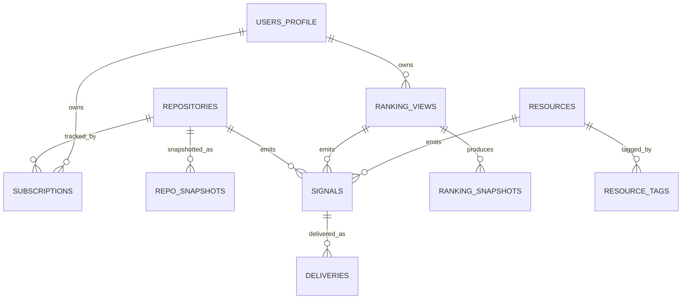
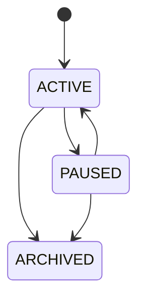
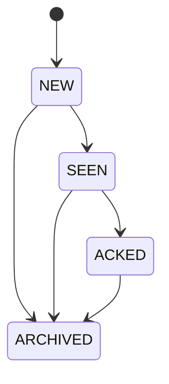

# 05. 数据模型与契约规范

状态：Normative  
优先级：P0 / P1  
目标：提供可直接落地到 SQLite、Rust struct、前端 DTO 的统一模型。

---

## 1. 建模原则

1. **一个核心概念只允许一个权威模型名。**
2. **原始外部 payload 与内部规范对象分层存储。**
3. **所有通知对象都必须可回溯到 Signal。**
4. **快照、信号、视图必须分离。**
5. **状态变化必须显式建模，不允许隐式推导代替持久化。**

---

## 2. 关系模型总览



说明：v1 单机模式可以把 `USERS_PROFILE` 简化为单本地用户配置对象，而不需要多用户表。

---

## 3. 主表定义

### 3.1 `repositories`

用途：缓存 GitHub 仓库的规范化元数据。

建议字段：

| 字段 | 类型 | 约束 | 说明 |
|---|---|---|---|
| `repo_id` | INTEGER | PK | GitHub repo id |
| `full_name` | TEXT | UNIQUE NOT NULL | `owner/name` |
| `owner` | TEXT | NOT NULL | owner login |
| `name` | TEXT | NOT NULL | repo short name |
| `html_url` | TEXT | NOT NULL | source url |
| `description` | TEXT | NULL | repo description |
| `default_branch` | TEXT | NOT NULL | default branch |
| `primary_language` | TEXT | NULL | primary language |
| `topics_json` | TEXT | NOT NULL | serialized topics |
| `archived` | INTEGER | NOT NULL | 0/1 |
| `disabled` | INTEGER | NOT NULL | 0/1 |
| `stargazers_count` | INTEGER | NOT NULL | latest stars |
| `forks_count` | INTEGER | NOT NULL | latest forks |
| `updated_at` | TEXT | NOT NULL | ISO8601 |
| `pushed_at` | TEXT | NULL | ISO8601 |
| `last_synced_at` | TEXT | NOT NULL | ISO8601 |

索引：

- unique(`full_name`)
- index(`primary_language`)
- index(`updated_at`)
- index(`stargazers_count`)

### 3.2 `subscriptions`

用途：存储用户跟踪关系与规则。

| 字段 | 类型 | 约束 | 说明 |
|---|---|---|---|
| `subscription_id` | TEXT | PK | ULID/UUID |
| `repo_id` | INTEGER | FK -> repositories.repo_id | 订阅目标 |
| `state` | TEXT | NOT NULL | ACTIVE/PAUSED/ARCHIVED |
| `tracking_mode` | TEXT | NOT NULL | STANDARD/ADVANCED |
| `event_types_json` | TEXT | NOT NULL | enabled signal types |
| `digest_window` | TEXT | NOT NULL | 12h/24h |
| `notify_high_immediately` | INTEGER | NOT NULL | 0/1 |
| `created_at` | TEXT | NOT NULL | ISO8601 |
| `updated_at` | TEXT | NOT NULL | ISO8601 |
| `last_successful_sync_at` | TEXT | NULL | ISO8601 |
| `cursor_release_id` | TEXT | NULL | release cursor |
| `cursor_tag_name` | TEXT | NULL | tag cursor |
| `cursor_branch_sha` | TEXT | NULL | default branch baseline |

约束：

- unique(active repo subscription) SHOULD 保证同一 repo 不重复活跃订阅。

### 3.3 `repo_snapshots`

用途：记录仓库状态的周期快照，用于趋势计算和对比。

| 字段 | 类型 | 约束 |
|---|---|---|
| `snapshot_id` | TEXT | PK |
| `repo_id` | INTEGER | FK |
| `snapshot_at` | TEXT | NOT NULL |
| `stargazers_count` | INTEGER | NOT NULL |
| `forks_count` | INTEGER | NOT NULL |
| `updated_at` | TEXT | NOT NULL |
| `pushed_at` | TEXT | NULL |
| `release_count` | INTEGER | NULL |

索引：

- index(`repo_id`, `snapshot_at desc`)

### 3.4 `ranking_views`

用途：存储用户保存的榜单定义。

| 字段 | 类型 | 约束 |
|---|---|---|
| `ranking_view_id` | TEXT | PK |
| `name` | TEXT | NOT NULL |
| `view_kind` | TEXT | NOT NULL |
| `query_template` | TEXT | NOT NULL |
| `filters_json` | TEXT | NOT NULL |
| `ranking_mode` | TEXT | NOT NULL |
| `k_value` | INTEGER | NOT NULL |
| `is_pinned` | INTEGER | NOT NULL |
| `created_at` | TEXT | NOT NULL |
| `updated_at` | TEXT | NOT NULL |
| `last_snapshot_at` | TEXT | NULL |

### 3.5 `ranking_snapshots`

用途：存储某个 RankingView 在某一时刻的结果快照。

| 字段 | 类型 | 约束 |
|---|---|---|
| `ranking_snapshot_id` | TEXT | PK |
| `ranking_view_id` | TEXT | FK |
| `snapshot_at` | TEXT | NOT NULL |
| `ranking_mode` | TEXT | NOT NULL |
| `items_json` | TEXT | NOT NULL |
| `stats_json` | TEXT | NOT NULL |

说明：

- `items_json` 可保存轻量 projection，避免每次都 join 全量 repo 表；
- 但 item 内 repo identity MUST 能回到 `repo_id`。

### 3.6 `resources`

用途：存储 Resource Radar 中的规范化资源对象。

| 字段 | 类型 | 约束 |
|---|---|---|
| `resource_id` | TEXT | PK |
| `source_repo_id` | INTEGER | FK -> repositories.repo_id |
| `resource_kind` | TEXT | NOT NULL |
| `title` | TEXT | NOT NULL |
| `summary` | TEXT | NULL |
| `source_url` | TEXT | NOT NULL |
| `languages_json` | TEXT | NOT NULL |
| `framework_tags_json` | TEXT | NOT NULL |
| `agent_tags_json` | TEXT | NOT NULL |
| `curation_level` | TEXT | NOT NULL |
| `last_scored_at` | TEXT | NULL |
| `is_active` | INTEGER | NOT NULL |

### 3.7 `resource_tags`

用途：资源标签明细表，用于过滤与相关性计算。

| 字段 | 类型 |
|---|---|
| `resource_id` | TEXT |
| `tag_type` | TEXT |
| `tag_value` | TEXT |

索引：

- index(`tag_type`, `tag_value`)
- index(`resource_id`)

### 3.8 `signals`

用途：统一存储可展示、可通知的变化对象。

| 字段 | 类型 | 约束 |
|---|---|---|
| `signal_id` | TEXT | PK |
| `signal_key` | TEXT | UNIQUE NOT NULL |
| `signal_type` | TEXT | NOT NULL |
| `source_kind` | TEXT | NOT NULL |
| `repo_id` | INTEGER | NULL |
| `ranking_view_id` | TEXT | NULL |
| `resource_id` | TEXT | NULL |
| `priority` | TEXT | NOT NULL |
| `state` | TEXT | NOT NULL |
| `title` | TEXT | NOT NULL |
| `summary` | TEXT | NULL |
| `evidence_json` | TEXT | NOT NULL |
| `occurred_at` | TEXT | NOT NULL |
| `bucket_start_at` | TEXT | NULL |
| `bucket_end_at` | TEXT | NULL |
| `created_at` | TEXT | NOT NULL |

要求：

- `signal_key` MUST 实现幂等去重；
- `evidence_json` MUST 保留外部事实引用所需字段；
- `source_kind` 可取 `REPOSITORY`, `RANKING_VIEW`, `RESOURCE`。

### 3.9 `deliveries`

用途：记录信号投递行为。

| 字段 | 类型 | 约束 |
|---|---|---|
| `delivery_id` | TEXT | PK |
| `signal_id` | TEXT | FK -> signals.signal_id |
| `channel` | TEXT | NOT NULL |
| `delivery_state` | TEXT | NOT NULL |
| `scheduled_at` | TEXT | NULL |
| `attempted_at` | TEXT | NULL |
| `delivered_at` | TEXT | NULL |
| `error_code` | TEXT | NULL |

---

## 4. 去重键规则

### 4.1 Release

```text
signal_key = repo_id + ":RELEASE_PUBLISHED:" + release_id
```

### 4.2 Tag

```text
signal_key = repo_id + ":TAG_PUBLISHED:" + tag_name
```

### 4.3 Default Branch Digest

```text
signal_key = repo_id + ":DEFAULT_BRANCH_ACTIVITY_DIGEST:" + bucket_start + ":" + bucket_end
```

### 4.4 Ranking Change

```text
signal_key = ranking_view_id + ":TOPK_VIEW_CHANGED:" + prev_snapshot_id + ":" + curr_snapshot_id
```

### 4.5 Resource Emerged

```text
signal_key = resource_id + ":RESOURCE_EMERGED:" + bucket_start + ":" + bucket_end
```

---

## 5. 状态机

### 5.1 SubscriptionState



约束：

- `ARCHIVED` 不是软删除的别名；
- archived subscription 的历史 signals 仍保留。

### 5.2 SignalState



约束：

- `ACKED` 意味用户已处理；
- `SEEN` 仅表示用户看过；
- `ARCHIVED` 表示退出默认工作区。

---

## 6. Contract 对象定义（API / IPC 级）

### 6.1 `RepositoryCard`

```json
{
  "repoId": 123456,
  "fullName": "owner/name",
  "htmlUrl": "https://github.com/owner/name",
  "description": "...",
  "primaryLanguage": "Rust",
  "topics": ["tauri", "desktop-app"],
  "stars": 1200,
  "forks": 140,
  "updatedAt": "2026-03-22T08:00:00Z",
  "isSubscribed": true
}
```

### 6.2 `SignalCard`

```json
{
  "signalId": "01H...",
  "signalType": "RELEASE_PUBLISHED",
  "priority": "HIGH",
  "state": "NEW",
  "sourceKind": "REPOSITORY",
  "repoId": 123456,
  "title": "owner/name 发布 v1.4.0",
  "summary": "包含新的 CLI 子命令与 breaking change 说明",
  "occurredAt": "2026-03-22T06:30:00Z",
  "evidence": {
    "releaseId": 998877,
    "releaseUrl": "https://github.com/owner/name/releases/tag/v1.4.0"
  }
}
```

### 6.3 `RankingViewSpec`

```json
{
  "rankingViewId": "rv_01",
  "name": "Rust Recent Movers",
  "filters": {
    "language": ["Rust"],
    "excludeArchived": true,
    "excludeForks": true,
    "minStars": 50,
    "updatedSinceDays": 30
  },
  "rankingMode": "MOMENTUM_7D",
  "k": 50
}
```

### 6.4 `RankingItem`

```json
{
  "repoId": 123456,
  "fullName": "owner/name",
  "rank": 3,
  "score": 0.87,
  "scoreBreakdown": {
    "starDelta": 0.42,
    "forkDelta": 0.11,
    "updatedRecency": 0.34
  },
  "isSubscribed": false
}
```

### 6.5 `ResourceCard`

```json
{
  "resourceId": "res_01",
  "resourceKind": "MCP_SERVER",
  "title": "acme/mcp-rust-tools",
  "sourceRepoId": 555,
  "languages": ["Rust"],
  "frameworkTags": ["Axum"],
  "agentTags": ["MCP", "coding-agent"],
  "score": 0.91,
  "whyRecommended": [
    "matches language Rust",
    "matches framework Axum",
    "high recent growth"
  ]
}
```

---

## 7. 数据保留策略

建议默认值：

- `signals`: 180 天
- `repo_snapshots`: 90 天
- `ranking_snapshots`: 90 天
- `deliveries`: 30 天
- `repositories`: 长期缓存，可按 LRU/最后访问裁剪

规则：

- 删除快照不应破坏现有 signal 的可读性；
- 删除 delivery 记录不应破坏 signal 本体。

---

## 8. 迁移策略

- 所有 schema 变更 MUST 使用显式 migration；
- `SignalType`, `ResourceKind`, `RankingMode` 变更必须包含数据兼容策略；
- 历史 signal 的 `evidence_json` 不得因结构变更无法读取。

---

## 9. 本文档结论

只要 `signals`, `ranking_snapshots`, `subscriptions`, `resources` 这四组模型设计正确，前端页面、摘要、通知、后续云同步都能围绕它们自然展开。

若这四组模型不清晰，任何 UI 或后端实现都会不断返工。
