# Component Diagram

> Shows the internal structure of services and their component interactions.

```mermaid
graph TB
    subgraph "packages/kernel"
        KernelIds[ids\nUUID, ULID, Snowflake]
        KernelError[error\nPlatformError hierarchy]
        KernelMoney[money\nCurrency, MonetaryAmount]
        KernelPagination[pagination\nPage/Cursor]
        KernelTenancy[tenancy\nTenantId, TenantContext]
        KernelTime[time\nTimestamp, Duration]
    end

    subgraph "packages/platform"
        PlatformConfig[config\nConfiguration loading]
        PlatformHealth[health\nHealth check endpoints]
        PlatformBuildInfo[buildinfo\nBuild metadata]
        PlatformEnv[env\nEnvironment detection]
        PlatformRelease[release\nRelease info]
        PlatformMeta[service_meta\nService metadata]
    end

    subgraph "packages/runtime/ports"
        RuntimeInvocation[invocation.rs\nService-to-service calls]
        RuntimePubSub[pubsub.rs\nPublish/Subscribe]
        RuntimeState[state.rs\nState management]
        RuntimeWorkflow[workflow.rs\nWorkflow orchestration]
        RuntimeLock[lock.rs\nDistributed locking]
        RuntimeBinding[binding.rs\nEvent bindings]
        RuntimeSecret[secret.rs\nSecret management]
        RuntimeQueue[queue.rs\nQueue operations]
    end

    subgraph "packages/runtime/adapters/memory"
        MemInvocation[Memory Invocation]
        MemPubSub[Memory PubSub]
        MemState[Memory State]
        MemWorkflow[Memory Workflow]
        MemLock[Memory Lock]
        MemBinding[Memory Binding]
        MemSecret[Memory Secret]
        MemQueue[Memory Queue]
    end

    subgraph "Auth Service"
        AuthDomain[domain\nUser/Session/Token entities]
        AuthApp[application\nLogin/Register/Refresh use cases]
        AuthPolicies[policies\nAuth policies, rate limits]
        AuthPorts[ports\nTokenRepo/SessionRepo/OAuthProvider]
        AuthEvents[events\nAuth domain events]
        AuthContracts[contracts\nAuth API contracts]
    end

    subgraph "Auth Service Infrastructure"
        JwtRepo[JwtTokenRepository\nJWT generation/validation]
        SessionRepo[LibSqlSessionRepository\nSession persistence]
        OAuthProvider[MockOAuthProvider\nMock OAuth for dev]
    end

    subgraph "User Service"
        UserDomain[domain\nUser entities/rules]
        UserApp[application\nUser CRUD use cases]
        UserPolicies[policies\nUser policies]
        UserPorts[ports\nUserRepo/EventPublisher]
        UserEvents[events\nUser domain events]
        UserContracts[contracts\nUser API contracts]
    end

    subgraph "Tenant Service"
        TenantDomain[domain\nTenant/Member entities]
        TenantApp[application\nOnboarding/Invite use cases]
        TenantPolicies[policies\nTenant isolation policies]
        TenantPorts[ports\nTenantRepo/MemberRepo]
        TenantEvents[events\nTenant domain events]
        TenantContracts[contracts\nTenant API contracts]
    end

    subgraph "packages/contracts"
        ContractHTTP[http\nHTTP API schemas]
        ContractEvents[events\nEvent schemas]
        ContractRPC[rpc\nRPC definitions]
        ContractErrorCodes[error-codes\nError code catalog]
    end

    subgraph "packages/authn"
        AuthnOIDC[oidc\nOIDC flow handling]
        AuthnPKCE[pkce\nPKCE for SPA/mobile]
        AuthnSession[session\nSession management]
        AuthnToken[token\nJWT token handling]
    end

    subgraph "packages/authz"
        AuthzModel[model\nAuthorization model]
        AuthzPorts[ports\nDecision engine interface]
        AuthzCaching[caching\nDecision caching]
        AuthzDecision[decision\nDecision engine]
        AuthzOpenFGA[adapters/openfga\nOpenFGA adapter]
    end

    subgraph "packages/data"
        DataTurso[turso\nTurso/libSQL client]
        DataSqlite[sqlite\nSQLite utilities]
        DataMigration[migration\nMigration runner]
        DataOutbox[outbox\nOutbox pattern]
        DataInbox[inbox\nInbox pattern]
    end

    subgraph "packages/messaging"
        MessagingNATS[nats\nNATS client]
        MessagingEnvelope[envelope\nMessage envelope]
        MessagingCodec[codec\nMessage serialization]
    end

    subgraph "packages/cache"
        CacheAPI[api\nCache interface]
        CachePolicies[policies\nCache policies]
        CacheMoka[adapters/moka\nIn-memory cache]
        CacheValkey[adapters/valkey\nDistributed cache]
    end

    subgraph "packages/storage"
        StorageAPI[api\nStorage interface]
        StoragePaths[paths\nPath resolution]
        StoragePolicies[policies\nStorage policies]
        StorageS3[adapters/s3\nS3 adapter]
        StorageMinIO[adapters/minio\nMinIO adapter]
        StorageLocalFS[adapters/localfs\nLocal filesystem]
    end

    subgraph "packages/observability"
        ObsTracing[tracing\nOpenTelemetry tracing]
        ObsMetrics[metrics\nMetrics collection]
        ObsLogging[logging\nStructured logging]
        ObsBaggage[baggage\nContext propagation]
        ObsOTEL[otel\nOpenTelemetry SDK]
    end

    subgraph "packages/security"
        SecCrypto[crypto\nCryptographic utilities]
        SecSigning[signing\nSigning utilities]
        SecRedaction[redaction\nPII redaction]
        SecPII[pii\nPII handling]
    end

    KernelIds --> AuthDomain
    KernelError --> AuthDomain
    KernelTenancy --> TenantDomain
    KernelTime --> UserDomain

    PlatformConfig --> AuthApp
    PlatformHealth --> AuthApp

    RuntimePubSub -.-> AuthEvents
    RuntimeState -.-> AuthApp

    MemPubSub --> RuntimePubSub
    MemState --> RuntimeState

    AuthDomain --> AuthApp
    AuthApp --> AuthPolicies
    AuthApp --> AuthPorts
    AuthApp --> AuthEvents

    AuthPorts -.implements.-> JwtRepo
    AuthPorts -.implements.-> SessionRepo
    AuthPorts -.implements.-> OAuthProvider

    UserDomain --> UserApp
    UserApp --> UserPolicies
    UserApp --> UserPorts

    TenantDomain --> TenantApp
    TenantApp --> TenantPolicies
    TenantApp --> TenantPorts

    ContractHTTP --> AuthContracts
    ContractEvents --> AuthEvents
    ContractErrorCodes --> AuthDomain

    AuthnOIDC --> AuthApp
    AuthnToken --> JwtRepo

    DataTurso --> SessionRepo
    DataOutbox --> AuthEvents

    MessagingNATS --> RuntimePubSub
    MessagingEnvelope --> AuthEvents

    CacheAPI --> AuthApp
    CacheValkey --> CacheAPI

    ObsTracing --> AuthApp
    ObsLogging --> AuthApp

    SecCrypto --> JwtRepo
    SecSigning --> JwtRepo
```



## Component Layering

```
┌─────────────────────────────────────────────────────┐
│  apps/* (Web, Desktop, Mobile)                      │
├─────────────────────────────────────────────────────┤
│  servers/* (BFF, Gateway)                           │
├─────────────────────────────────────────────────────┤
│  services/* (Auth, User, Tenant, etc.)              │
│    ├── domain/  (entities, rules)                   │
│    ├── application/ (use cases)                     │
│    ├── policies/ (business policies)                │
│    ├── ports/ (abstract interfaces)                 │
│    ├── events/ (domain events)                      │
│    └── contracts/ (API contracts)                   │
├─────────────────────────────────────────────────────┤
│  packages/* (kernel, platform, runtime, contracts)  │
│    ├── kernel/ (lowest level: ids, error, time)     │
│    ├── platform/ (config, health, metadata)          │
│    ├── runtime/ports/ (8 runtime abstractions)      │
│    ├── runtime/adapters/memory/ (test implementations)│
│    ├── contracts/ (HTTP, events, RPC, errors)       │
│    ├── authn/ (OIDC, PKCE, session, token)          │
│    ├── authz/ (model, ports, caching, decision)     │
│    ├── data/ (turso, sqlite, migration, outbox)     │
│    ├── messaging/ (nats, envelope, codec)           │
│    ├── cache/ (api, policies, adapters)             │
│    ├── storage/ (api, paths, policies, adapters)    │
│    ├── observability/ (tracing, metrics, logging)   │
│    └── security/ (crypto, signing, redaction, PII)  │
└─────────────────────────────────────────────────────┘
```
