# Container Diagram

> Shows the internal structure of each system container and their interactions.

```mermaid
graph TB
    subgraph "Web Application"
        SvelteRoutes[SvelteKit Routes]
        SvelteLib[SvelteKit Lib\nAPI Clients/Stores/Components]
        AuthClient[Auth Client\nOIDC/PKCE]
        SyncClient[Sync Client\nOffline/Conflict Resolution]
    end

    subgraph "Desktop Application (Tauri)"
        TauriCommands[Tauri Commands]
        TauriAPI[Tauri API Bridge]
        TauriStore[Tauri Store\nLocal Storage]
        TauriSync[Tauri Sync Module]
    end

    subgraph "Web BFF (Axum)"
        BFFRoutes[BFF Routes]
        BFFHandlers[BFF Handlers\nAggregation/Validation]
        BFFAuth[Auth Middleware\nToken Validation/Tenant Injection]
        BFFTelemetry[Telemetry Middleware\nTrace/Metrics/Logging]
    end

    subgraph "Auth Service"
        AuthDomain[Auth Domain\nUser/Session Entities]
        AuthApp[Auth Application\nLogin/Register/Token Use Cases]
        AuthPorts[Auth Ports\nTokenRepo/SessionRepo/OAuthProvider]
        AuthEvents[Auth Events\nUserCreated/LoggedIn/TokenRefreshed]
    end

    subgraph "User Service"
        UserDomain[User Domain\nUser Entities/Rules]
        UserApp[User Application\nCRUD Use Cases]
        UserPorts[User Ports\nUserRepo/EventPublisher]
        UserEvents[User Events\nUserCreated/Updated/Deleted]
    end

    subgraph "Tenant Service"
        TenantDomain[Tenant Domain\nTenant/Member Entities]
        TenantApp[Tenant Application\nOnboarding/Invite Use Cases]
        TenantPorts[Tenant Ports\nTenantRepo/MemberRepo/EventPublisher]
        TenantEvents[Tenant Events\nTenantCreated/MemberAdded]
    end

    subgraph "Indexer Worker"
        IndexerSource[Indexer Source\nEventSource/Stream Consumer]
        IndexerTransform[Indexer Transform\nParse/Enrich/Filter]
        IndexerSink[Indexer Sink\nWrite to Storage/Index]
        IndexerCheckpoint[Indexer Checkpoint\nProgress Tracking]
    end

    subgraph "Outbox Relay"
        OutboxPoll[Outbox Poll\nDatabase Polling]
        OutboxDedupe[Outbox Dedupe\nIdempotency Check]
        OutboxPublish[Outbox Publish\nEvent Publishing to NATS]
        OutboxAck[Outbox Ack\nMark as Published]
    end

    subgraph "Infrastructure"
        NATS[(NATS\nJetStream)]
        Turso[(Turso/libSQL)]
        Valkey[(Valkey)]
        MinIO[(MinIO)]
    end

    SvelteRoutes --> SvelteLib
    SvelteLib --> AuthClient
    SvelteLib --> SyncClient
    
    TauriCommands --> TauriAPI
    TauriCommands --> TauriStore
    TauriCommands --> TauriSync
    
    BFFRoutes --> BFFHandlers
    BFFHandlers --> BFFAuth
    BFFHandlers --> BFFTelemetry
    
    AuthDomain --> AuthApp
    AuthApp --> AuthPorts
    AuthApp --> AuthEvents
    
    UserDomain --> UserApp
    UserApp --> UserPorts
    UserApp --> UserEvents
    
    TenantDomain --> TenantApp
    TenantApp --> TenantPorts
    TenantApp --> TenantEvents
    
    IndexerSource --> IndexerTransform
    IndexerTransform --> IndexerSink
    IndexerTransform --> IndexerCheckpoint
    
    OutboxPoll --> OutboxDedupe
    OutboxDedupe --> OutboxPublish
    OutboxPublish --> OutboxAck
    
    SvelteRoutes -.HTTP.-> BFFRoutes
    TauriCommands -.IPC.-> BFFRoutes
    
    BFFHandlers -.Internal Call.-> AuthApp
    BFFHandlers -.Internal Call.-> UserApp
    BFFHandlers -.Internal Call.-> TenantApp
    
    AuthEvents -.Publish.-> NATS
    UserEvents -.Publish.-> NATS
    TenantEvents -.Publish.-> NATS
    
    OutboxPublish -.Publish.-> NATS
    IndexerSource -.Consume.-> NATS
    
    AuthPorts -.Store.-> Turso
    UserPorts -.Store.-> Turso
    TenantPorts -.Store.-> Turso
    IndexerSink -.Store.-> Turso
    
    AuthPorts -.Cache.-> Valkey
    UserPorts -.Cache.-> Valkey
```

## Container Responsibilities

| Container | Technology | Responsibility |
|-----------|-----------|----------------|
| Web Application | SvelteKit | Client-side UI, routing, state management |
| Desktop Application | Tauri 2 | Desktop shell, native capabilities, local storage |
| Web BFF | Axum (Rust) | API aggregation, auth middleware, telemetry |
| Auth Service | Rust library | Authentication, sessions, OAuth flows |
| User Service | Rust library | User management, profiles, preferences |
| Tenant Service | Rust library | Multi-tenant isolation, onboarding, members |
| Indexer Worker | Rust binary | Event stream processing, indexing |
| Outbox Relay | Rust binary | Reliable event publishing via outbox pattern |
| NATS | NATS + JetStream | Message broker, pub/sub, streams |
| Turso | libSQL | Primary database, embedded or client/server |
| Valkey | Redis-compatible | Caching, session storage, rate limiting |
| MinIO | S3-compatible | Object storage, file uploads, backups |
