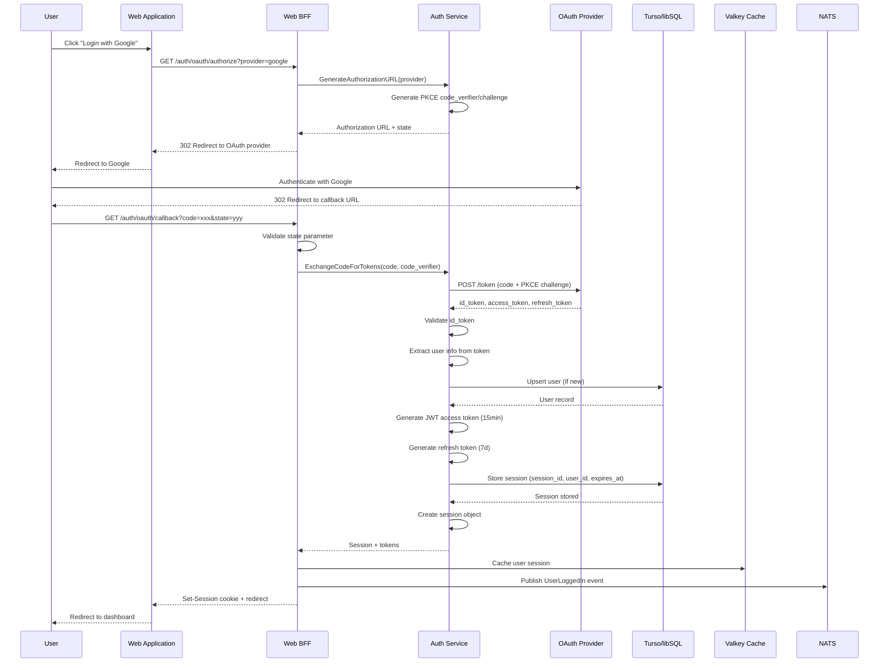
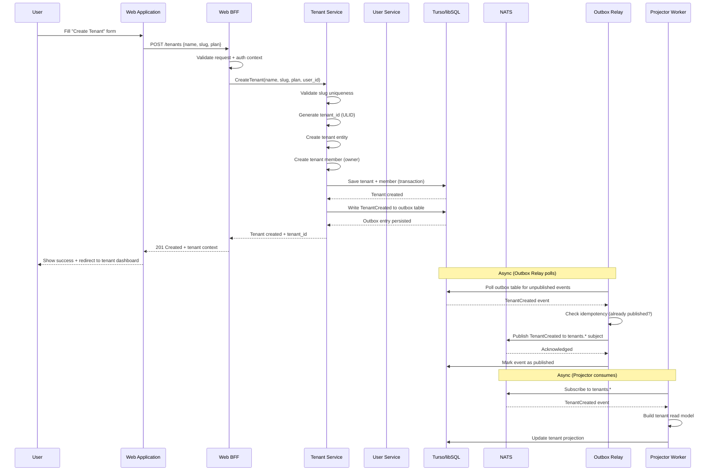
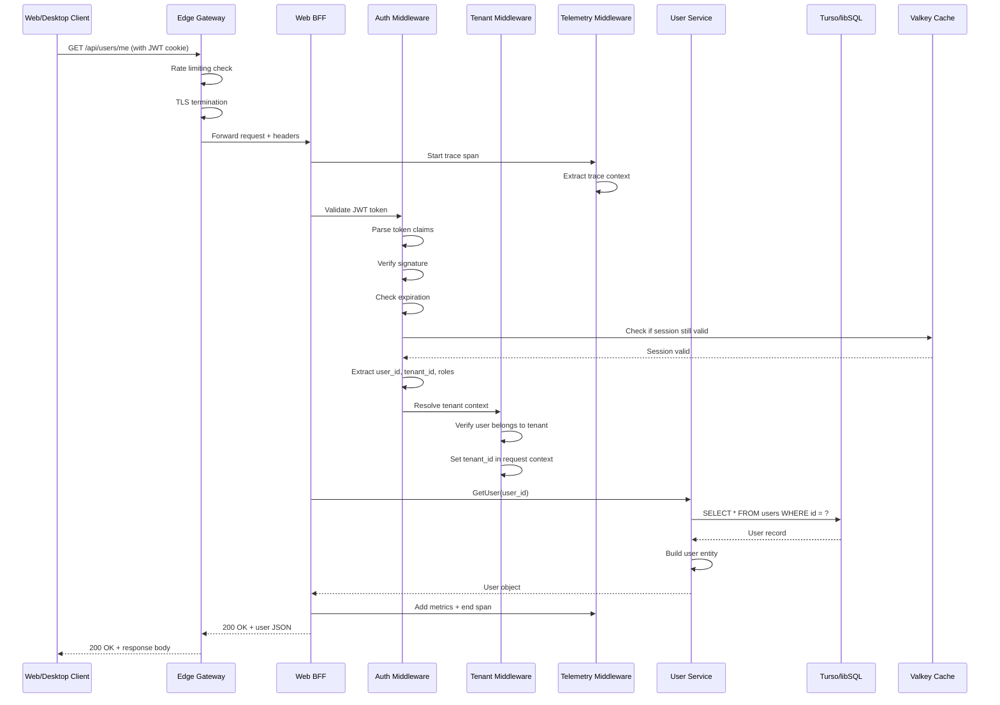
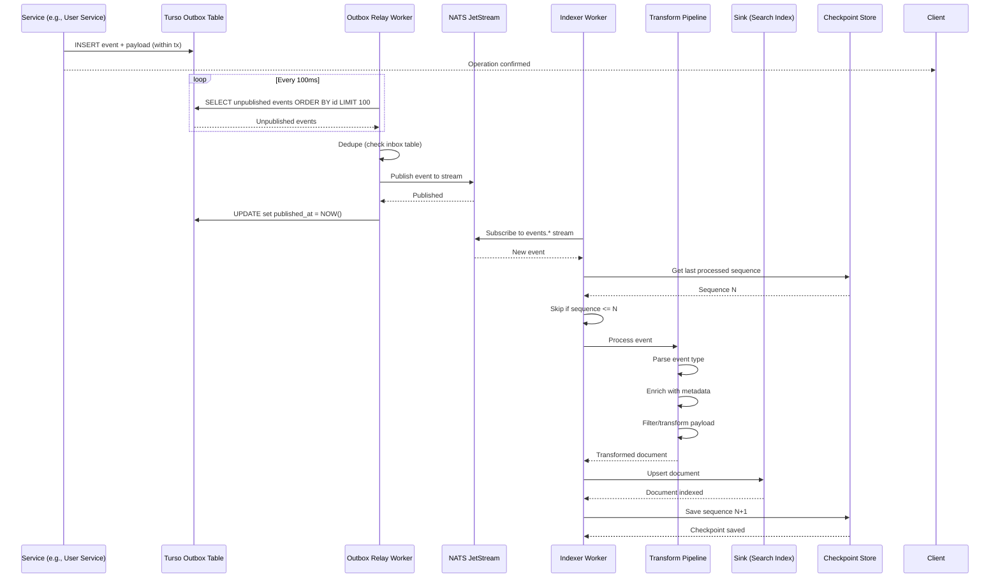
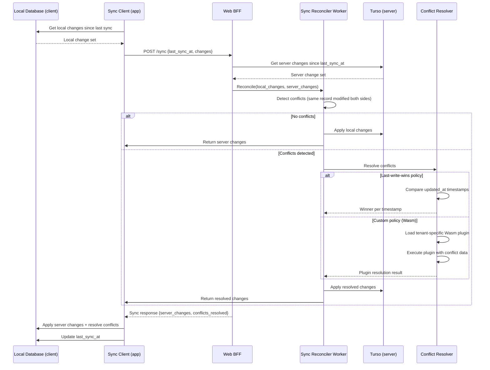

# Sequence Diagrams

> Shows key interaction flows between system components.

## 1. OAuth Login Flow

## 2. Tenant Onboarding Flow

## 3. API Request Flow (with Auth + Tenant)

## 4. Event Processing Flow (Indexer Worker)

## 5. Sync Reconciliation Flow

