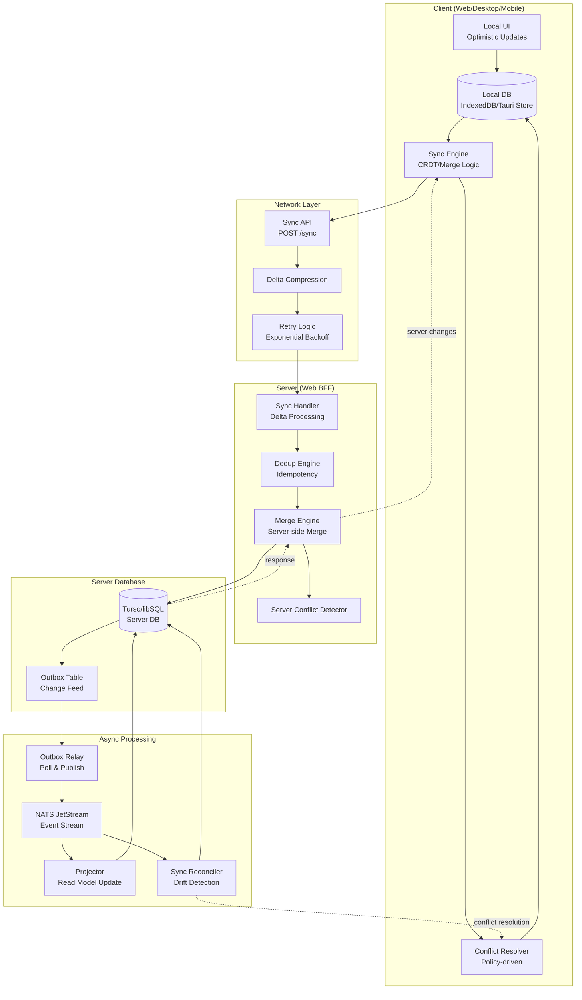
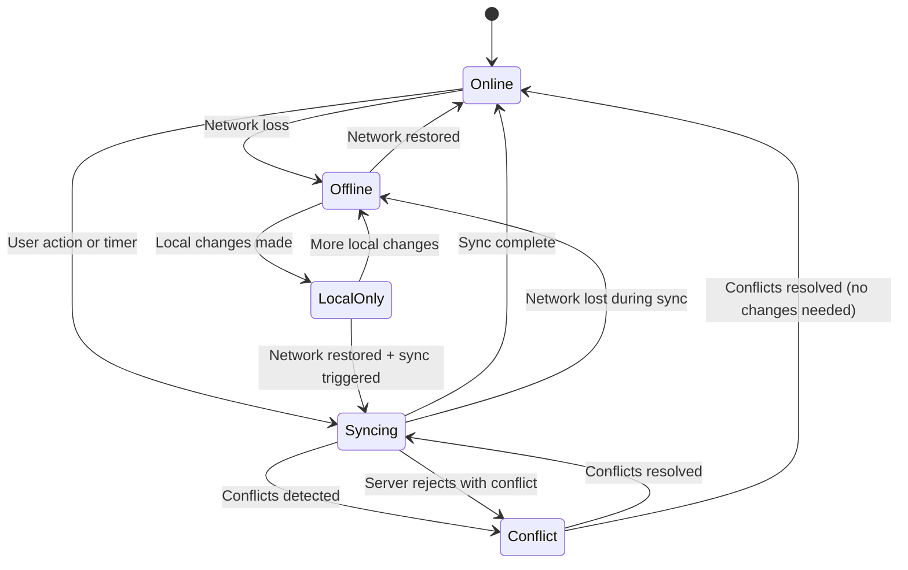

# Sync Flow Diagram

> Shows the offline-first synchronization architecture.

## Sync States

## Sync Strategies

| Strategy | Use Case | Conflict Resolution |
|----------|----------|-------------------|
| **Last-Write-Wins** | Simple fields, settings | Timestamp comparison |
| **Field-Level Merge** | Documents, forms | Per-field merge |
| **CRDT** | Counters, sets, maps | Mathematical convergence |
| **Custom (Wasm)** | Tenant-specific rules | Plugin-based resolution |
| **Manual** | Critical data | User selection required |
