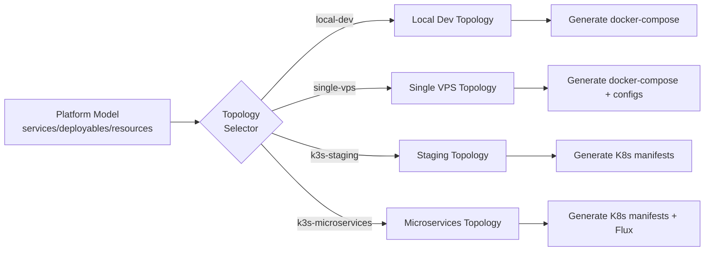
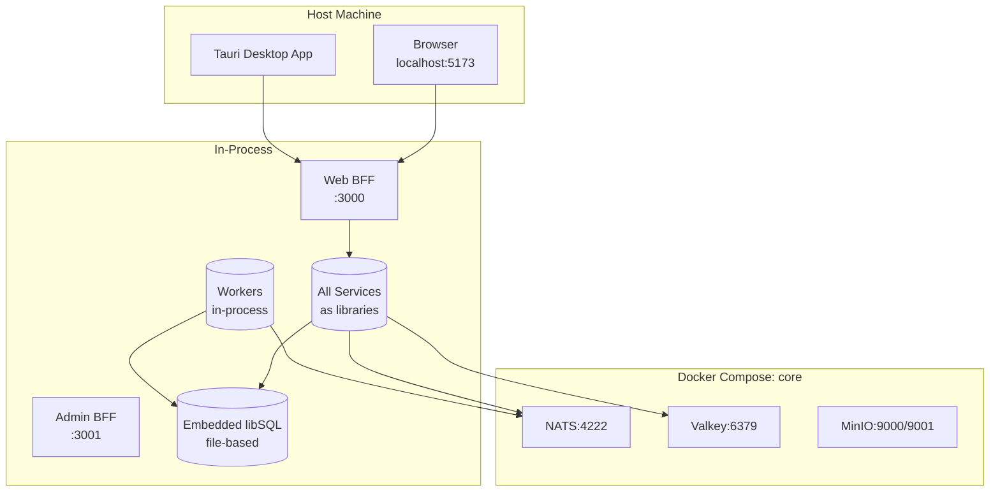
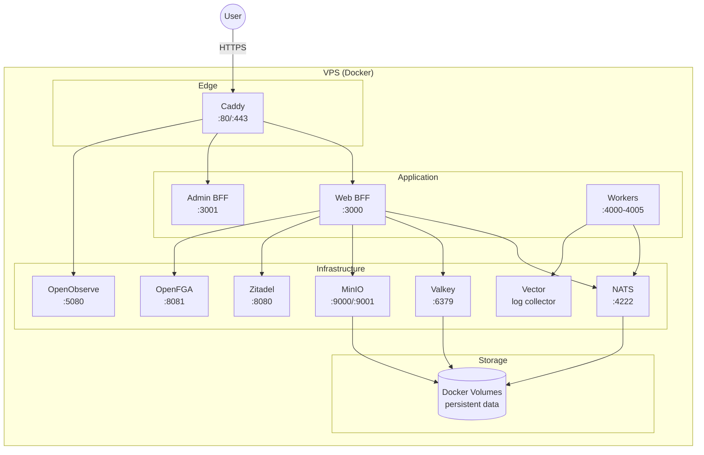
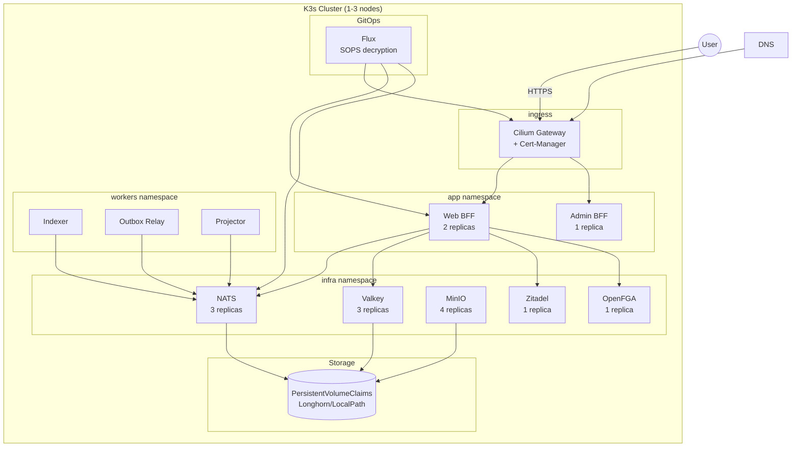
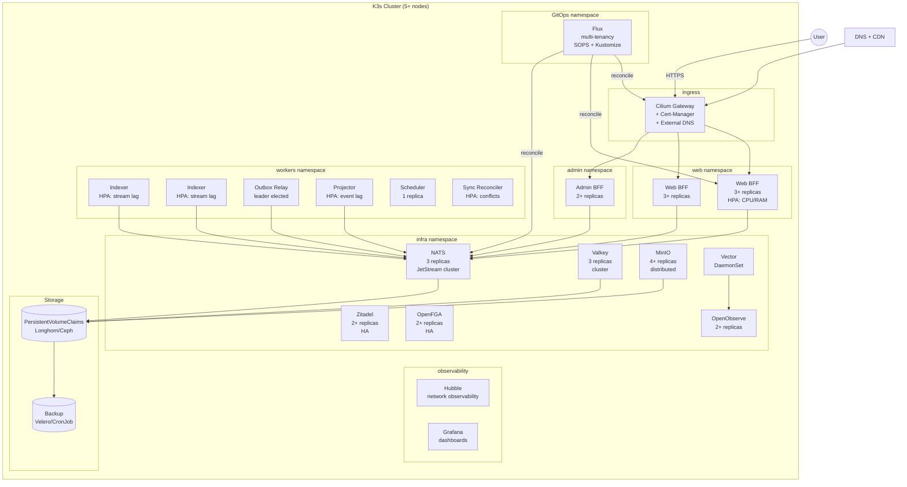

# Topology Diagram

> Shows how the same platform can be deployed in different topological configurations.

## Topology Overview

The platform is topology-agnostic. The same services, deployables, and resources can be assembled into different topologies without changing business logic. Topology is defined in `platform/model/topologies/*.yaml`.

## Topology: Local Development

### Characteristics
| Aspect | Detail |
|--------|--------|
| Processes | 2 (web-bff, admin-bff) + docker services |
| Database | Embedded (no separate process) |
| Workers | Optional, in-process or separate |
| Auth | MockOAuthProvider |
| AuthZ | In-memory decision engine |
| Network | localhost only |
| Persistence | File-based (libSQL, Valkey RDB, MinIO volumes) |

## Topology: Single VPS

### Characteristics
| Aspect | Detail |
|--------|--------|
| Processes | 8-10 containers |
| Database | libSQL file or Turso server |
| Workers | Separate containers |
| Auth | Zitadel (self-hosted) |
| AuthZ | OpenFGA (self-hosted) |
| Network | Docker network, Caddy reverse proxy |
| Scaling | Vertical only (increase VPS resources) |

## Topology: K3s Staging

### Characteristics
| Aspect | Detail |
|--------|--------|
| Nodes | 1-3 (staging) |
| Processes | Kubernetes Pods |
| Replicas | Minimal (1-2 per service) |
| Workers | Separate namespace |
| Auth | Zitadel |
| AuthZ | OpenFGA |
| Network | Cilium CNI, Gateway API |
| Scaling | Manual or basic HPA |
| GitOps | Flux with SOPS |

## Topology: K3s Microservices (Production)

### Characteristics
| Aspect | Detail |
|--------|--------|
| Nodes | 5+ (production) |
| Processes | Kubernetes Pods with HPA |
| Replicas | 2-3+ per service (HA) |
| Workers | Independent scaling per worker |
| Auth | Zitadel HA |
| AuthZ | OpenFGA HA |
| Network | Cilium CNI, Gateway API, Hubble |
| Scaling | HPA (CPU, memory, custom metrics) |
| GitOps | Flux with Kustomize + SOPS |
| Backup | Velero or CronJob-based |
| Monitoring | OpenObserve + Hubble + Grafana |

## Topology Switching

The same platform model supports all topologies. Switching topology only requires:

1. Edit `platform/model/topologies/<name>.yaml`
2. Run `just render-k8s env=dev` or `just render-local`
3. Deploy generated manifests

**No business logic changes required.**
