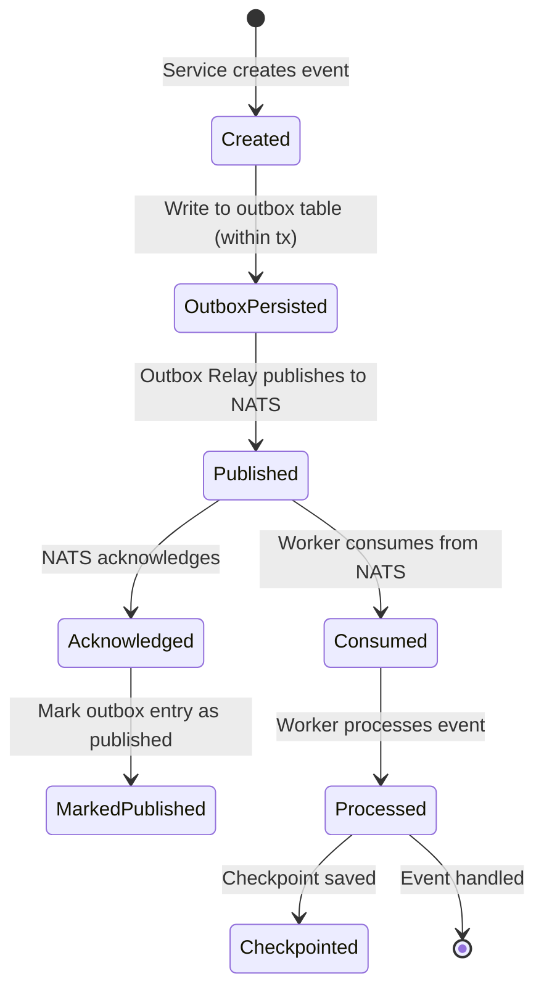

# Event Schema Documentation

> All events follow the unified `AppEvent` envelope defined in `packages/contracts/events/`.

## Event Envelope

All events are wrapped in a standard envelope for consistent processing:

```rust
pub struct EventEnvelope {
    pub id: EventId,              // UUID v7
    pub event: AppEvent,           // Typed event payload
    pub source_service: String,   // e.g., "user-service", "tenant-service"
    pub correlation_id: Option<String>, // Trace correlation
}
```

```rust
pub struct MessageEnvelope {
    pub message_id: String,
    pub event: AppEvent,
    pub topic: String,            // e.g., "tenants.created", "users.logged_in"
    pub source_service: String,
    pub correlation_id: Option<String>,
    pub timestamp: chrono::DateTime<chrono::Utc>,
}
```

## Unified Event Types (`AppEvent`)

The global `AppEvent` enum uses `serde(tag = "type", content = "payload")` for polymorphic serialization.

### Tenant Events

#### `tenant.created`

**Source Service**: `tenant-service`
**Topic Pattern**: `tenants.*`

```json
{
  "type": "tenant.created",
  "payload": {
    "tenant_id": "tenant_01hxyz...",
    "owner_sub": "user_01hxyz..."
  }
}
```

**Schema**:
| Field | Type | Required | Description |
|-------|------|----------|-------------|
| `tenant_id` | string (ULID) | Yes | Unique tenant identifier |
| `owner_sub` | string | Yes | OAuth subject of tenant owner |

---

#### `tenant.member_added`

**Source Service**: `tenant-service`
**Topic Pattern**: `tenants.*.members`

```json
{
  "type": "tenant.member_added",
  "payload": {
    "tenant_id": "tenant_01hxyz...",
    "user_sub": "user_02hxyz...",
    "role": "member"
  }
}
```

**Schema**:
| Field | Type | Required | Description |
|-------|------|----------|-------------|
| `tenant_id` | string (ULID) | Yes | Tenant identifier |
| `user_sub` | string | Yes | OAuth subject of new member |
| `role` | string | Yes | Member role (`owner`, `admin`, `member`) |

---

#### `tenant.updated`

**Source Service**: `tenant-service`

```json
{
  "type": "tenant.updated",
  "payload": {
    "tenant_id": "tenant_01hxyz...",
    "name": "Updated Corp",
    "updated_at": "2026-04-12T10:00:00Z"
  }
}
```

---

#### `tenant.deleted`

**Source Service**: `tenant-service`

```json
{
  "type": "tenant.deleted",
  "payload": {
    "tenant_id": "tenant_01hxyz...",
    "deleted_at": "2026-04-12T10:00:00Z"
  }
}
```

---

#### `tenant.member_removed`

**Source Service**: `tenant-service`

```json
{
  "type": "tenant.member_removed",
  "payload": {
    "tenant_id": "tenant_01hxyz...",
    "user_id": "user_02hxyz...",
    "removed_at": "2026-04-12T10:00:00Z"
  }
}
```

---

#### `tenant.member_role_changed`

**Source Service**: `tenant-service`

```json
{
  "type": "tenant.member_role_changed",
  "payload": {
    "tenant_id": "tenant_01hxyz...",
    "user_id": "user_02hxyz...",
    "old_role": "member",
    "new_role": "admin",
    "changed_at": "2026-04-12T10:00:00Z"
  }
}
```

---

### User Events

#### `user.created`

**Source Service**: `user-service`
**Topic Pattern**: `users.*`

```json
{
  "type": "user.created",
  "payload": {
    "user_id": "user_01hxyz...",
    "user_sub": "google|123456",
    "display_name": "John Doe",
    "email": "john@example.com",
    "created_at": "2026-04-12T10:00:00Z"
  }
}
```

**Schema**:
| Field | Type | Required | Description |
|-------|------|----------|-------------|
| `user_id` | string (ULID) | Yes | Unique user identifier |
| `user_sub` | string | Yes | OAuth subject identifier |
| `display_name` | string | Yes | User's display name |
| `email` | string? | No | User's email address |
| `created_at` | datetime | Yes | Creation timestamp |

---

#### `user.logged_in`

**Source Service**: `auth-service` / `user-service`
**Topic Pattern**: `users.*.sessions`

```json
{
  "type": "user.logged_in",
  "payload": {
    "user_id": "user_01hxyz...",
    "user_sub": "google|123456",
    "login_at": "2026-04-12T10:00:00Z"
  }
}
```

---

#### `user.updated`

**Source Service**: `user-service`

```json
{
  "type": "user.updated",
  "payload": {
    "user_id": "user_01hxyz...",
    "display_name": "John Updated",
    "email": "john.updated@example.com",
    "updated_at": "2026-04-12T11:00:00Z"
  }
}
```

---

#### `user.deleted`

**Source Service**: `user-service`

```json
{
  "type": "user.deleted",
  "payload": {
    "user_id": "user_01hxyz...",
    "user_sub": "google|123456",
    "deleted_at": "2026-04-12T10:00:00Z"
  }
}
```

---

#### `tenant.initialized`

**Source Service**: `user-service`
**Topic Pattern**: `tenants.*.init`

```json
{
  "type": "tenant.initialized",
  "payload": {
    "user_id": "user_01hxyz...",
    "user_sub": "google|123456",
    "tenant_id": "tenant_01hxyz...",
    "role": "owner",
    "created": "2026-04-12T10:00:00Z",
    "initialized_at": "2026-04-12T10:00:00Z"
  }
}
```

---

### Counter Events

#### `counter.changed`

**Source Service**: `counter-service`
**Topic Pattern**: `counters.*`

```json
{
  "type": "counter.changed",
  "payload": {
    "tenant_id": "tenant_01hxyz...",
    "new_value": 42,
    "delta": 1
  }
}
```

**Schema**:
| Field | Type | Required | Description |
|-------|------|----------|-------------|
| `tenant_id` | string (ULID) | Yes | Tenant that owns this counter |
| `new_value` | integer | Yes | New counter value |
| `delta` | integer | Yes | Change amount (+/-) |

---

### Chat Events

#### `chat.message_sent`

**Source Service**: `chat-service`
**Topic Pattern**: `chat.*.messages`

```json
{
  "type": "chat.message_sent",
  "payload": {
    "conversation_id": "conv_01hxyz...",
    "message_id": "msg_01hxyz...",
    "sender_id": "user_01hxyz..."
  }
}
```

---

## Event Lifecycle



## Event Ordering & Delivery Guarantees

| Guarantee | Implementation |
|-----------|---------------|
| **At-least-once** | Outbox pattern + NATS JetStream ack |
| **Ordering** | NATS stream sequence numbers per shard |
| **Deduplication** | Inbox table tracking processed message IDs |
| **Checkpointing** | Per-worker sequence tracking |

## Topic Naming Convention

```
<domain>.<resource>.<action>.<sub-resource>

Examples:
  tenants.created           # All tenant creations
  tenants.abc123.members    # Members of specific tenant
  users.*.sessions          # Sessions for any user
  counters.*                # All counter changes
  chat.*.messages           # Messages in any conversation
```
