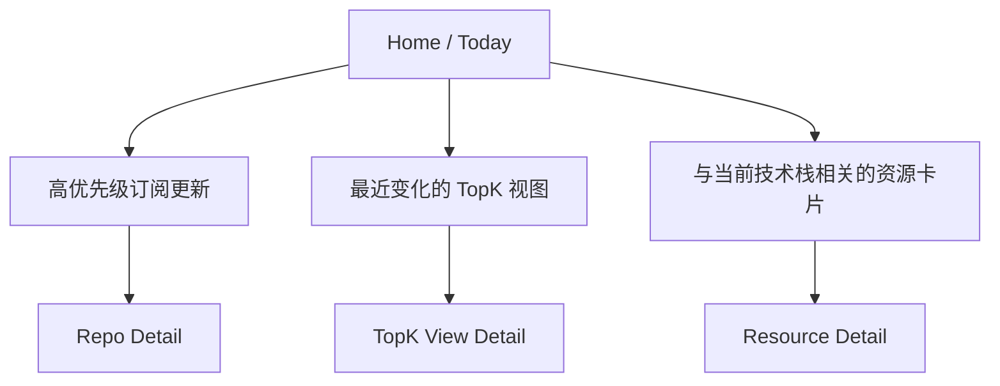
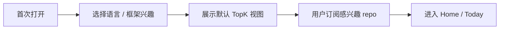
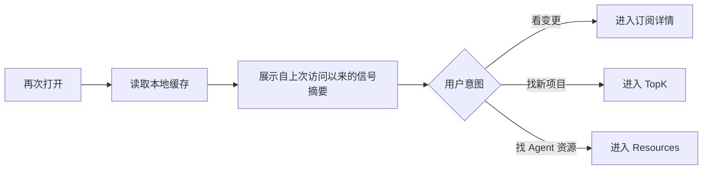
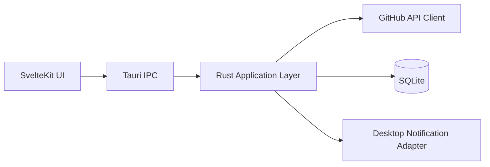
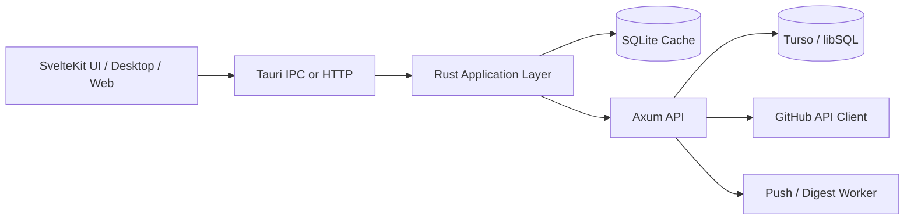
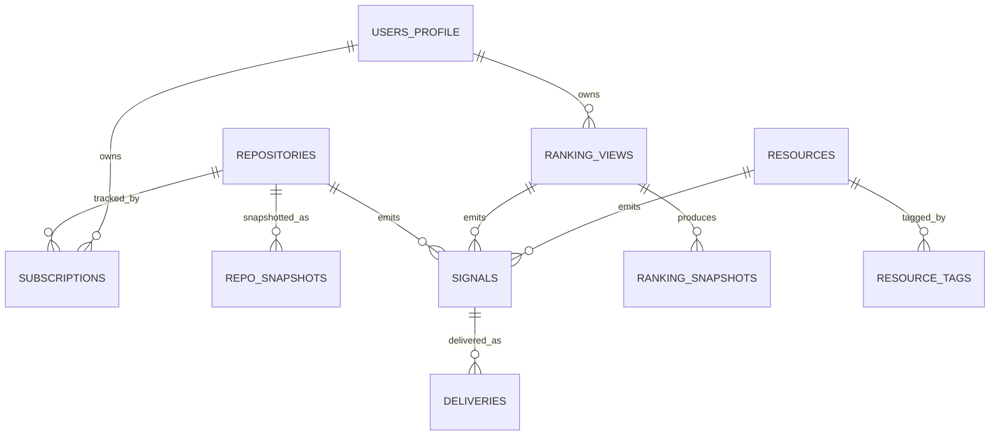
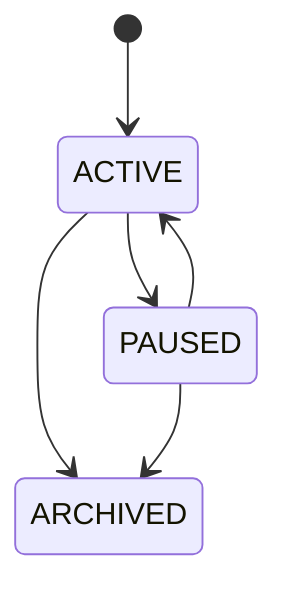
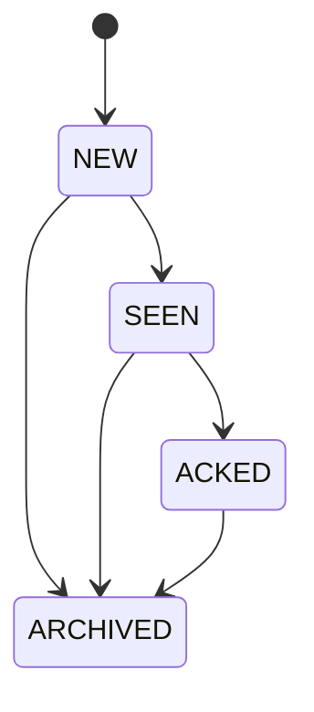

# geek taste 开发指导文档集

状态：v1.0 母稿  
面向读者：首次接触 `geek taste` 的架构师、技术负责人、前后端工程师、测试工程师、产品工程协作人员  
文档目标：在**无历史上下文**条件下，直接支持 v1 架构设计、实现拆分、开发排期、验收与后续演进。

---

## 1. 本文档集解决什么问题

本套文档集回答以下 P0 问题：

1. `geek taste` 到底是什么，不是什么。
2. v1 真实要做的能力边界是什么。
3. 关键术语、事件语义、排序语义、通知语义如何定义，避免团队成员各自理解。
4. 为什么首版推荐 `Tauri + SvelteKit + SQLite` 本地优先，以及何时引入 `Axum + Turso`。
5. 为什么不能把“任意 GitHub 仓库更新监控”设计成通用 webhook 产品。
6. 排行榜、订阅、资源雷达三条能力线如何共用同一套域模型，而不是各自为战。
7. 每个里程碑的产出、验收标准、反模式与硬约束是什么。

---

## 2. 阅读顺序（强制建议）

若你是：

- **架构负责人**：按 `00 -> 01 -> 02 -> 03 -> 04 -> 06 -> 07` 阅读。
- **前端工程师**：按 `00 -> 01 -> 04 -> 05 -> 06 -> 07` 阅读。
- **Rust / Tauri / Axum 工程师**：按 `00 -> 01 -> 03 -> 04 -> 05 -> 06 -> 07` 阅读。
- **测试 / QA**：按 `01 -> 04 -> 05 -> 06 -> 07` 阅读。

---

## 3. 文档目录

| 文件 | 作用 | 类型 |
|---|---|---|
| `00_context_and_design_master_v1.md` | v1 设计母稿，定义产品、用户、流程、信息架构 | 母稿 |
| `01_p0_domain_language_spec.md` | P0 术语、枚举、状态、事件与去歧义规范 | 规范 |
| `02_v1_scope_boundaries_assumptions_antipatterns.md` | 范围、边界、假设、非目标、反模式、决策摘要 | 规范 |
| `03_system_architecture_spec.md` | 系统架构、模块边界、部署模式、技术选型、数据流 | 架构 |
| `04_ranking_subscription_notification_spec.md` | 排行榜、订阅、资源雷达、通知、轮询与评分规则 | 业务规范 |
| `05_data_model_and_contracts.md` | 数据模型、关系约束、契约对象、示例 payload、索引规则 | 数据与接口 |
| `06_milestones_and_acceptance.md` | 里程碑、交付物、入口/出口、验收标准、DoD | 计划与验收 |
| `07_quality_security_and_operations.md` | 性能、安全、测试、监控、异常处理、发布与运行策略 | 非功能规范 |
| `08_references.md` | 外部核验资料与裁决说明 | 证据 |
| `spec/domain-vocabulary.yaml` | 机器可读的核心枚举与语义字典 | 机器规范 |
| `spec/v1-defaults.yaml` | v1 默认配置与阈值 | 机器规范 |

---

## 4. 文档使用约束

1. **母稿优先于口头描述。** 若实现与母稿冲突，以母稿和 P0 规范为准。
2. **规范优先于代码习惯。** 术语、枚举、状态机不得由各模块自行发明。
3. **边界优先于扩展欲望。** 任何新增能力先对照 `02_v1_scope_boundaries_assumptions_antipatterns.md`。
4. **验收优先于“感觉差不多”。** 任何功能完成都必须能落到 `06_milestones_and_acceptance.md` 中的场景与清单。
5. **证据纪律必须执行。** 外部事实请先看 `08_references.md`，无法核验的内容必须显式标注为 `[假设]` 或 `[推断]`。

---

## 5. 关键结论快照

### 5.1 产品定位

`geek taste` 是一个**开发者技术雷达与行动工作台**，不是泛资讯站，也不是 GitHub UI 的再包装。

### 5.2 v1 主路径

v1 只服务三类高相关任务：

1. **发现**：看语言/框架/主题下的 TopK 技术趋势。
2. **跟踪**：订阅目标仓库，接收“可用更新”级别的变化摘要。
3. **赋能**：按语言/框架发现与 code agent 生产力相关的 MCP / Skills / Agent 资源。

### 5.3 技术路线

- 首版推荐：`Tauri + SvelteKit + SQLite`，本地优先，桌面优先。
- 条件引入：当且仅当需要跨设备同步、服务端调度、Web 伴生端、集中式推送时，再引入 `Axum + Turso`。
- v1 不推荐以 `SurrealDB` 作为主数据库。

### 5.4 GitHub 约束裁决

- [核验] Tauri 官方 SvelteKit 集成要求 `static-adapter`，Tauri 不支持 server-based frontend solution。[R1][R2]
- [核验] GitHub Search API 结果存在 `1000` 条搜索结果上限与 `4000` 仓库搜索范围限制，且认证搜索限流为 `30 req/min`。[R3]
- [核验] GitHub Repository Events API 明确**不是实时接口**，事件延迟可能从 `30 秒到 6 小时`，并建议通过 `ETag` / `X-Poll-Interval` 做轮询优化。[R5]
- [核验] 仓库 webhook 的创建/管理要求仓库 owner 或 admin 权限，因此无法作为“任意公开仓库订阅”的通用监控机制。[R6]

因此，v1 订阅模型必须是：**轮询 + 差分 + 摘要 + 本地缓存**。

---

## 6. 仍然保留的开放项（P1，不阻塞开工）

1. 资源雷达是否在 v1 末期加入有限人工策展后台。
2. 是否在 v1.1 提供“高级订阅模板”（维护者模式 / 普通跟踪模式）。
3. 是否在 v1.1 支持带用户私有仓库的本地单机模式。
4. UI 设计提示词（Figma AI / 其他生成工具）将在架构母稿冻结后单独编制。

---

## 7. 修改规则

任何人要修改 P0 术语、边界、默认行为、验收标准，必须同时更新：

- `01_p0_domain_language_spec.md`
- `02_v1_scope_boundaries_assumptions_antipatterns.md`
- `04_ranking_subscription_notification_spec.md`
- `06_milestones_and_acceptance.md`
- `spec/domain-vocabulary.yaml`（若涉及枚举/状态）
- `spec/v1-defaults.yaml`（若涉及默认值/阈值）

未同步修改，视为规范变更无效。


---

# 00. geek taste v1 设计母稿

状态：Draft for Build  
适用范围：v1 首发版本  
文档性质：母稿；定义产品的最小正确语义与实现方向。

---

## 1. 产品一句话定义

`geek taste` 是一个面向重度 GitHub 观察者与 AI coding 采用者的**跨端技术雷达工作台**：

- 用 **TopK 榜单**发现值得关注的新趋势；
- 用 **Repo 订阅**跟踪值得处理的可用更新；
- 用 **Agent 资源雷达**发现与当前语言/框架相关的 MCP / Skills / Agent 生产力资源。

该产品的核心输出不是“更多信息”，而是**高信噪比、可行动、低打扰的技术信号**。

---

## 2. 设计目标与非目标

### 2.1 设计目标

1. **让用户在 30 秒内完成判断**：今天有哪些仓库/资源值得看。
2. **降低长期跟踪成本**：用户无需手动刷大量 GitHub 页面。
3. **把探索和跟踪放进同一工作流**：从 TopK 发现项目，再一键转为订阅。
4. **保持高信息密度但低认知切换**：界面简洁，不等于信息稀薄。
5. **保持本地优先与性能可预测**：启动快，离线可读，弱网可退化。

### 2.2 非目标

v1 不追求以下目标：

1. 替代 GitHub 全站搜索。
2. 替代 GitHub Discussions / Issues / PR 审查工具。
3. 成为内容社区、媒体站或社交网络。
4. 提供实时秒级全仓库告警。
5. 覆盖所有非 GitHub 技术资源来源。

---

## 3. 核心用户定义

### 3.1 核心用户（首发 ICP）

**重度 GitHub 跟踪者 + AI coding 工具采用者**。

满足以下至少三项：

- 每周多次查看 GitHub 项目动态；
- 会按语言/框架趋势调整技术选型；
- 使用或尝试 Cursor / Claude Code / Windsurf / Cline / 自建 agent loop；
- 关心 MCP / Skills / Agent 工具链；
- 有一批长期关注的仓库，需要知道“什么时候真的值得看”。

### 3.2 次级用户（非首发主设计对象）

1. 普通开源浏览者；
2. 偶发性看榜单的轻度用户；
3. 企业治理场景中的组织管理员；
4. 只关注私有仓库内部协作流的团队成员。

这些用户可被兼容，但不主导 v1 的信息架构和默认行为。

---

## 4. 用户核心任务（Jobs-to-be-Done）

### JTBD-1：趋势发现

> “我想快速知道，在我关心的语言/框架里，最近哪些项目值得关注。”

成功条件：

- 用户能在 1 个页面内完成过滤、排序、浏览、订阅。
- 用户不需要理解复杂查询语言就能得到可靠结果。
- 结果默认不是噪声堆砌，而是能直接进入下一步（订阅 / 收藏 / 打开原仓库）。

### JTBD-2：目标仓库跟踪

> “我不想手动刷仓库页面，但我又不想错过真正有用的更新。”

成功条件：

- 用户能明确知道仓库发生的是哪一类更新；
- 默认只提醒“可用更新”，而非所有活动；
- 通知频率默认克制，支持 12h / 24h digest。

### JTBD-3：Agent 能力赋能

> “我想知道在当前语言/框架下，最近有哪些 MCP / Skills / Agent 资源值得看。”

成功条件：

- 用户无需在不同站点和关键词之间来回跳转；
- 资源是按技术栈和上下文相关的，而不是“全网 agent 资源大杂烩”；
- 发现之后能直接进入仓库、文档或后续收藏流程。

---

## 5. 产品论证（Why this product exists）

### 5.1 市场层面的缺口

现有工具通常只满足单一任务：

- GitHub 本体：适合单仓库深挖，不适合持续跨项目雷达；
- 各类趋势站：适合“逛”，不适合“跟”；
- RSS / 通知工具：适合事件推送，不适合技术筛选；
- AI 工具目录：适合堆资源，不适合结合语言/框架上下文。

`geek taste` 的价值在于把**发现 -> 跟踪 -> 行动**放到一条闭环中。

### 5.2 设计裁决

v1 的设计中心必须是：

- **Signal over Feed**：信号优先，而不是无限流。
- **Actionability over Completeness**：可行动优先，而不是全量覆盖。
- **Defaults over Configuration Explosion**：强默认优先，而不是初期过度可配置。
- **Desktop-first Workbench over Website-first Portal**：工作台优先，而不是资讯站优先。

---

## 6. v1 功能面定义

### 6.1 一级功能

1. **今日摘要（Today）**
   - 聚合上次访问以来的高优先级信号。
   - 是首页默认重点区域。

2. **TopK 榜单（TopK Views）**
   - 按语言、框架、主题、时间窗进行发现。
   - 支持多种排序视图：`Popular`、`Recently Updated`、`Momentum`。

3. **我的订阅（Subscriptions）**
   - 用户维护自己关心的 repo 列表。
   - 默认只跟踪可用更新级别的变化。

4. **资源专题榜（Resource Radar）**
   - 按语言/框架呈现与 code agent 生产力相关的 GitHub 资源。
   - 以专题榜和相关推荐的方式呈现，不独立发展成内容平台。

5. **通知与规则（Rules）**
   - 配置 digest 窗口、优先级、是否开启桌面提醒、安静时段等。

### 6.2 首页信息架构

首页不是“把所有模块平铺”。首页的职责只有两个：

1. 告诉用户自上次访问以来发生了什么；
2. 给用户一个最快的下一步动作入口。

建议结构：



---

## 7. v1 信息架构

### 7.1 导航

- Home
- TopK
- Subscriptions
- Resources
- Rules / Settings

### 7.2 页面意图定义

| 页面 | 页面存在的唯一理由 |
|---|---|
| Home | 帮用户快速判断今天先看什么 |
| TopK | 帮用户发现新机会和新项目 |
| Subscriptions | 帮用户持续跟踪既有关注对象 |
| Resources | 帮用户发现与 agent 提效相关的资源 |
| Rules | 帮用户控制频率、噪音和默认行为 |

---

## 8. 核心交互流

### 8.1 冷启动流



裁决：

- 首次冷启动**不应**强迫用户先配置大量订阅。
- 冷启动阶段必须先让 TopK 提供即时价值。
- 订阅行为是“发现后转跟踪”的二级留存机制。

### 8.2 回访流



### 8.3 订阅创建流

- 入口 1：从 TopK item 一键订阅。
- 入口 2：手动搜索仓库并订阅。
- 入口 3：从 Resource 详情页跳到其源仓库并订阅。

订阅默认值：

- 事件类型：`RELEASE_PUBLISHED`, `TAG_PUBLISHED`, `DEFAULT_BRANCH_ACTIVITY_DIGEST`
- digest：24h
- 桌面推送：仅 High Priority

---

## 9. 产品对象模型（概念层）

`geek taste` 在概念上只有五种核心对象：

1. **Repository**：GitHub 仓库。
2. **Subscription**：用户对 Repository 的跟踪关系。
3. **Signal**：一次经过归一化后值得展示或提醒的变化。
4. **RankingView**：一个可重复、可缓存、可比较的榜单视图。
5. **Resource**：与 code agent 生产力相关的 GitHub 资源对象。

所有页面都应围绕这五类对象展开，禁止再发明新的“隐性主对象”。

---

## 10. v1 成功判据

### 10.1 产品层成功判据

至少满足以下四条中的三条：

1. 用户首次会话中，能在 3 分钟内建立至少 1 个订阅或保存 1 个 TopK 视图。
2. 用户回访时，能在 30 秒内识别 1 个值得打开的信号。
3. 用户对默认通知频率的主观反馈是“够用、不吵”。
4. 用户能够把 TopK 视图中的项目转为长期订阅，而不是只短暂浏览。

### 10.2 工程层成功判据

1. 应用可离线打开并展示上次同步缓存。
2. 同步逻辑可中断、可恢复、可幂等。
3. 关键术语、状态、枚举在前后端和数据库中语义一致。
4. 所有高优先级通知都能溯源到一个明确的 `Signal` 对象。

---

## 11. v1 明确不做的东西

1. 实时秒级仓库事件流。
2. GitHub 全量 issue/discussion 订阅中心。
3. 用户间共享、评论、点赞、协作。
4. 全自动 LLM 生成摘要作为核心路径依赖。
5. 覆盖 npm / crates / PyPI / docs 网站等多源异构爬取。
6. Web-first 的开放内容门户。
7. 一上来做“所有开发者都能用”的全能产品。

---

## 12. 首版技术与交付裁决

### 12.1 客户端形态裁决

v1 以**桌面优先**为原则，原因：

1. 本地缓存与离线能力更自然；
2. GitHub token 单机安全管理更可控；
3. 桌面通知、后台轮询、批量缓存更符合使用场景；
4. Tauri + SvelteKit 组合在桌面上最稳。[R1][R2]

### 12.2 数据源裁决

v1 的主数据源是 GitHub API 与 GitHub 仓库元数据。

`Resource Radar` 亦以 GitHub 为主源；其他来源只允许通过后续扩展引入。

### 12.3 排行榜裁决

`TopK` 在 v1 中是**产品定义的排行榜语义**，不是“GitHub Trending 的接口映射”。

- [核验] GitHub 官方 Search API 提供 repository search 及多种排序，但当前核验资料未发现一个可直接作为官方 Trending API 的公开 REST endpoint。[R3][推断]
- 因此本产品的 TopK 必须由**查询模板 + 过滤器 + 快照 + 评分公式**定义。

---

## 13. UI / UX 原则（不含生成提示词）

### 13.1 视觉原则

1. **Dense but calm**：高密度但不压迫。
2. **Keyboard-first**：重度用户应能快速筛选和跳转。
3. **State-visible**：已读、未读、订阅、缓存状态必须显式可见。
4. **Source-traceable**：任何信号都必须可以打开原始 GitHub 来源。
5. **Low-motion**：避免视觉噪声与过度动效。

### 13.2 交互原则

1. 默认排序必须可信。
2. 筛选器必须可组合，但不可过载。
3. 任何榜单项都必须支持“一步订阅”。
4. 任何订阅项都必须支持“查看变更依据”。
5. 任何资源项都必须解释“为什么推荐给我”。

---

## 14. 设计冻结条件

以下条件成立时，v1 母稿可视为冻结：

1. `01_p0_domain_language_spec.md` 中的所有 P0 术语已经不再歧义；
2. `02_v1_scope_boundaries_assumptions_antipatterns.md` 中的非目标与边界已获团队认可；
3. `03` 至 `07` 中的实现与验收约束已经闭环；
4. 没有任何关键流程依赖“后面再说”的未定义语义。

---

## 15. 母稿摘要

v1 的真正难点不是“把 GitHub 数据拉下来”，而是：

- 定义什么值得提醒；
- 定义什么算趋势；
- 定义资源与技术栈的相关性；
- 把三条能力线收敛到一套清晰、低噪音、可实现的对象模型中。

因此，**信号语义、边界控制、缓存策略、默认值设计**比“堆更多接口”更重要。


---

# 01. P0 领域语言与语义规范

状态：Normative  
优先级：P0  
适用对象：所有研发、测试、产品、设计与文档编写者

---

## 1. 目的

本文档用于消除以下类型的歧义：

1. 同一术语被不同模块赋予不同含义；
2. 同一事件在 UI、数据库、通知中表现不一致；
3. “排行榜 / 订阅 / 资源”三套能力各自发明自己的对象和状态；
4. 后续实现阶段出现“这个词到底是什么意思”的返工。

本文档中的定义具备**规范性约束**。

---

## 2. 规范性关键字

- **MUST**：强制，违反即为实现错误或设计错误。
- **SHOULD**：强建议，若不遵循，必须记录理由与替代方案。
- **MAY**：可选，不影响规范一致性。
- **MUST NOT**：禁止。

---

## 3. 核心对象定义

### 3.1 Repository

`Repository` 指一个 GitHub 仓库对象，是 `owner/name` 唯一命名空间下的源对象。

Repository MUST 至少包含以下属性：

- `repo_id`：GitHub 仓库唯一 ID
- `full_name`：`owner/name`
- `owner`
- `name`
- `html_url`
- `default_branch`
- `primary_language`
- `topics[]`
- `stargazers_count`
- `forks_count`
- `archived`
- `disabled`
- `updated_at`
- `pushed_at`

去歧义：

- `updated_at` 不是“有可用更新”的同义词。
- `pushed_at` 不是“应该立即通知”的同义词。
- `Repository` 不是 `Signal`。

### 3.2 Subscription

`Subscription` 指用户与 Repository 之间的**跟踪关系**，不是 GitHub 原生 watch/star 关系。

Subscription MUST 包含：

- 订阅对象：一个 `Repository`
- 事件范围：允许哪些 `SignalType`
- 频率策略：`DIGEST_12H` / `DIGEST_24H` / `IMMEDIATE_HIGH_ONLY`
- 优先级策略：哪些信号可触发桌面通知
- 生命周期状态：`ACTIVE` / `PAUSED` / `ARCHIVED`

去歧义：

- “订阅”是本产品内的概念，不等于 GitHub 的 `watch`。
- “取消订阅”不应删除历史信号，应改变订阅状态。

### 3.3 Signal

`Signal` 指一个**经过归一化、可展示、可去重、可通知、可追溯**的变化对象。

Signal MUST 满足：

1. 有明确来源（source）；
2. 有明确所属对象（通常是一个 Repository 或 Resource）；
3. 有明确类型（`SignalType`）；
4. 有明确时间戳；
5. 有可稳定复算的 dedupe key；
6. 有可选的优先级（priority）；
7. 能被用户标记为已读 / 已处理；
8. 能打开原始依据。

去歧义：

- 原始 GitHub API payload 不是 Signal。
- UI 上的一行列表项是 Signal 的表现，不是 Signal 本身。

### 3.4 RankingView

`RankingView` 指一个**可重复生成**的榜单视图定义，由以下四类输入决定：

1. 候选查询（query template）
2. 过滤条件（filters）
3. 排序模式（ranking mode）
4. K 值（top size）

去歧义：

- RankingView 是“榜单定义”，不是“榜单结果”。
- RankingSnapshot 才是某时刻的榜单结果。

### 3.5 Resource

`Resource` 指与 code agent 生产力相关的 GitHub 资源对象。

v1 中，Resource 主要来源于 GitHub 仓库或由 GitHub 仓库承载的项目。

Resource MUST 至少有：

- `resource_kind`
- `source_repo_id`
- `tags[]`
- `languages[]`
- `framework_tags[]`
- `agent_tags[]`
- `score_inputs`
- `source_url`

去歧义：

- Resource 不是任意网页条目。
- v1 中 Resource 默认以 GitHub 为主源，而不是泛互联网抓取对象。

---

## 4. 关键术语定义

### 4.1 TopK

`TopK` 指在一个 RankingView 上，应用过滤与排序后返回的前 K 个结果。

规范：

- K MUST 为显式参数，不得隐式写死在 UI 文案里。
- v1 允许的 K 值集合：`10, 20, 50, 100`。
- 若候选不足 K，则返回实际数量。

### 4.2 可用更新（Usable Update）

`Usable Update` 指**足够值得普通跟踪者知晓**的更新，而不是“任何仓库活动”。

v1 中，可用更新 MUST 仅从以下集合中产生：

- `RELEASE_PUBLISHED`
- `TAG_PUBLISHED`
- `DEFAULT_BRANCH_ACTIVITY_DIGEST`
- `PR_MERGED_DIGEST`（仅高级模式，默认关闭）

以下活动 v1 MUST NOT 直接视为可用更新：

- 单个 commit push
- 单个 issue comment
- 单个 discussion comment
- 单个 star/fork 变化

### 4.3 Digest

`Digest` 指在给定时间窗内对多个 Signal 的批量摘要。

Digest MUST：

- 有明确时间窗；
- 有明确来源集合；
- 可追溯到组成它的 Signal 列表；
- 不能替代原始 Signal 存储。

### 4.4 Snapshot

`Snapshot` 指某个时刻记录下来的候选对象状态，用于后续比较与增量计算。

Snapshot 不是事件；Snapshot 是用来计算趋势和变化的材料。

### 4.5 Relevance

`Relevance` 指一个 Resource 或 RankingItem 与用户当前技术栈/兴趣集合的相关程度。

v1 中相关性 MUST 基于显式标签重叠计算，不依赖黑盒推荐模型。

### 4.6 Priority

`Priority` 指 Signal 对通知与首页排序的影响程度。

v1 标准优先级：

- `HIGH`
- `MEDIUM`
- `LOW`

规则：

- `HIGH` 才允许默认桌面提醒。
- `MEDIUM` 默认只进入 digest 与首页。
- `LOW` 默认只进入列表，不主动提醒。

---

## 5. 枚举规范

### 5.1 SignalType

v1 合法枚举：

- `RELEASE_PUBLISHED`
- `RELEASE_PRERELEASED`
- `TAG_PUBLISHED`
- `DEFAULT_BRANCH_ACTIVITY_DIGEST`
- `PR_MERGED_DIGEST`
- `TOPK_VIEW_CHANGED`
- `RESOURCE_EMERGED`
- `RESOURCE_RERANKED`

说明：

- `TOPK_VIEW_CHANGED` 表示某个已保存的榜单视图发生足够显著的结果变化。
- `RESOURCE_EMERGED` 表示某技术栈下出现新的高相关资源。
- `RESOURCE_RERANKED` 表示资源排序显著变化；默认不发桌面通知。

### 5.2 SubscriptionState

- `ACTIVE`
- `PAUSED`
- `ARCHIVED`

语义：

- `ACTIVE`：参与同步与通知。
- `PAUSED`：保留历史，不参与同步和通知。
- `ARCHIVED`：只保留记录，不再显示于默认活跃列表。

### 5.3 SignalState

- `NEW`
- `SEEN`
- `ACKED`
- `ARCHIVED`

语义：

- `NEW`：尚未在 UI 中展示给用户。
- `SEEN`：已被用户浏览，但未明确处理。
- `ACKED`：用户已确认/处理。
- `ARCHIVED`：不再出现在默认工作区。

### 5.4 RankingMode

- `STARS_DESC`
- `UPDATED_DESC`
- `MOMENTUM_24H`
- `MOMENTUM_7D`
- `CURATED_RELEVANCE`

说明：

- `MOMENTUM_*` 需要依赖 Snapshot 计算增量；在冷启动没有历史快照时 MUST 优雅降级。
- `CURATED_RELEVANCE` 仅用于资源榜，不用于通用 repo 榜。

### 5.5 ResourceKind

- `MCP_SERVER`
- `SKILL_PACK`
- `AGENT_FRAMEWORK`
- `TEMPLATE`
- `TOOLING`
- `EXAMPLE_REPO`

说明：

- `SKILL_PACK` 指用于增强 coding agent 的可复用技能包、流程包、任务模板、指令集或其等价形式。
- v1 不对“是否真实符合某协议完整规范”做自动认证，除非存在明确来源证据。

---

## 6. 时间语义规范

### 6.1 时间窗

v1 的 digest 时间窗合法值为：

- `12h`
- `24h`

规则：

- 时间窗 MUST 由用户配置时区解释；
- 若用户未配置，使用设备本地时区；
- 服务端模式下仍以用户时区为准，而不是服务器时区。

### 6.2 自上次访问以来

`Since last visit` 指用户上次成功进入前台并完成主页可交互后的时间点。

该语义 MUST NOT 与“上次同步时间”混淆。

---

## 7. 去重与归因规范

### 7.1 去重原则

同一个外部事实不得在同一逻辑时间窗内生成多个等价 Signal。

示例：

- 同一个 release 不得因多次轮询生成多个 `RELEASE_PUBLISHED`。
- 同一个 24h digest 窗内的默认分支活动，只允许一个 `DEFAULT_BRANCH_ACTIVITY_DIGEST`。

### 7.2 归因原则

每个 Signal MUST 能归因到以下至少一项：

- GitHub release ID
- tag name + repo
- repo full_name + time bucket
- ranking_view_id + snapshot_pair
- resource_id + ranking window

### 7.3 冲突裁决

若同一时间窗内既检测到 `RELEASE_PUBLISHED` 又检测到 `TAG_PUBLISHED`：

- 若 tag 属于该 release，对用户展示 MUST 以 `RELEASE_PUBLISHED` 为主；
- `TAG_PUBLISHED` MAY 作为内部证据，但不应重复提醒。

---

## 8. 排行榜语义规范

### 8.1 榜单不是搜索结果页

TopK MUST 被视为**有状态、可比较、可保存**的产品对象，而不是一次性搜索返回。

### 8.2 榜单必须稳定

同一 `RankingView` 在相同输入、相同时间点、相同缓存状态下 MUST 返回相同结果顺序。

### 8.3 榜单必须可解释

用户必须能理解：

- 它看的是哪个范围；
- 它按什么排序；
- 为什么这条结果在前面；
- 该结果能否一键订阅。

---

## 9. 通知语义规范

### 9.1 通知不是显示层特效

通知必须由 Signal 驱动，而不是由 UI 页面自行判断触发。

### 9.2 通知优先级默认值

- `HIGH`：默认可桌面提醒 + digest 收录
- `MEDIUM`：默认仅 digest + Home
- `LOW`：默认仅列表显示

### 9.3 通知克制原则

v1 MUST NOT：

- 对 TopK 的每次轻微排名变化发即时提醒；
- 对 Resource 的常规重排发即时提醒；
- 对默认分支每个 commit 发提醒。

---

## 10. 错误与退化语义

### 10.1 Stale

`STALE` 指数据可显示，但新鲜度已超过设计阈值。

`STALE` 不是 `ERROR`。

### 10.2 Degraded

`DEGRADED` 指某功能可部分工作，但不能满足完整语义。

示例：

- 无历史 Snapshot 时，`MOMENTUM_24H` 降级为 `UPDATED_DESC`；
- 无网络时，只展示缓存，不执行同步。

### 10.3 Failed

`FAILED` 指一次同步或查询未成功完成，且当前结果不可作为新状态。

FAILED MUST 记录错误原因与可重试性。

---

## 11. 术语禁用清单

以下模糊词 MUST NOT 直接出现在实现说明和需求验收中，除非被更具体定义替代：

- “热门”
- “最新”
- “重大更新”
- “趋势”
- “推荐”
- “智能排序”
- “相关项目”

替代方式：

- 用明确时间窗、排序模式、阈值或评分规则替代。

---

## 12. 规范摘要

本产品的所有讨论，最终都要落回以下最小句法：

- 用户订阅的是 `Repository`；
- 系统产生的是 `Signal`；
- 用户查看的是 `RankingView` / `RankingSnapshot`；
- 系统推荐的是 `Resource`；
- 通知和首页都只是这些对象的视图，而不是额外发明的新概念。


---

# 02. v1 范围、边界、假设、反模式

状态：Normative  
优先级：P0 / P1  
目标：防止 scope creep、防止错误抽象、防止产品变成半成品聚合站。

---

## 1. v1 范围（In Scope）

### 1.1 平台范围

v1 正式支持：

- macOS 桌面端（Tauri）
- Windows 桌面端（Tauri）

v1 可保留技术准备但不承诺正式支持：

- Web 只读伴生端
- Linux 桌面
- 移动端

### 1.2 数据源范围

v1 主数据源 MUST 为 GitHub 官方 API 与仓库元数据。

允许使用：

- Repositories API
- Search API
- Releases API
- Tags / Topics / Languages / Basic repo metadata
- Events API（仅作为辅助信号，不作为实时保证）

### 1.3 业务范围

v1 只做以下三条能力线：

1. **TopK 发现**
2. **Repo 订阅与可用更新摘要**
3. **基于语言/框架的 Agent 资源雷达**

### 1.4 交互范围

v1 允许：

- 创建/编辑/暂停订阅
- 保存/编辑榜单视图
- 查看信号与摘要
- 标记已读/已处理
- 打开原始 GitHub 来源
- 设定通知频率

v1 不要求：

- 社交互动
- 多人协作
- 评论/分享/点赞

---

## 2. v1 不在范围（Out of Scope）

以下能力明确排除：

1. GitHub 全站搜索替代品；
2. Issues / PR / Discussions 的全功能收件箱；
3. 秒级实时告警系统；
4. 私有仓库的跨设备同步承诺；
5. 全网技术资源爬虫；
6. 用户生成内容平台；
7. 复杂组织级权限模型；
8. 大模型摘要作为核心必要依赖；
9. 自建通用推荐系统平台；
10. 先做后想语义、靠代码反向定义产品。

---

## 3. 设计边界

### 3.1 GitHub 集成边界

#### [核验] 边界 B1：任意公开仓库订阅不能以 webhook 作为通用方案

- 仓库 webhook 的创建与管理需要仓库 owner 或 admin 权限。[R6]
- 因此，本产品**不能假设**可在用户想跟踪的每个公开仓库上注册 webhook。

裁决：

- v1 订阅引擎 MUST 以轮询为主。
- webhook 只可能用于“用户自有仓库 / 后续受控场景”，不是通用产品主干。

#### [核验] 边界 B2：Repository Events API 不是实时接口

- GitHub 官方说明 repository events API 不为实时用例而设计，延迟可能在 30 秒到 6 小时之间。[R5]

裁决：

- v1 不得承诺“实时”或“准实时秒级更新”。
- 默认通知语言应使用“摘要 / 最近变化 / 自上次检查以来”，而不是“实时告警”。

#### [核验] 边界 B3：Search API 存在速率和结果范围上限

- 搜索结果上限为 1000；搜索范围最多穿透 4000 个匹配仓库；认证搜索速率默认 30 req/min。[R3]

裁决：

- TopK 必须建立在**缓存视图与快照机制**上，而不是 UI 每次操作都直打 Search API。
- 复杂过滤器组合必须受控，不得让用户在前端无约束拼接超长查询。

### 3.2 技术架构边界

#### [核验] 边界 B4：Tauri + SvelteKit 必须按静态前端思路设计

- Tauri 官方 SvelteKit 指南明确要求 `static-adapter`，且不支持 server-based frontend solution。[R2]

裁决：

- v1 前端必须以 SPA / SSG 思路设计；
- 不得把 SvelteKit 的 server runtime 当成桌面端主运行时依赖。

### 3.3 数据边界

- 本地缓存是主缓存，不是“临时 hack”。
- SQLite 是 v1 主权威数据库，不是过渡测试品。
- Turso 仅在需要云同步/云调度时引入。
- SurrealDB 不进入 v1 主路径。

---

## 4. 核心假设（Assumptions）

### A1 [HIGH]
目标用户更愿意为“低噪音的高价值摘要”持续回访，而不是为“全量事件流”持续回访。

理由：普通跟踪者需要可行动信号，而不是所有活动。

### A2 [HIGH]
`TopK -> 一键订阅 -> Home 回访` 是 v1 的主留存闭环。

理由：TopK 解决冷启动，订阅解决持续性。

### A3 [HIGH]
资源雷达在 v1 中是增强能力，而不是首要留存驱动。

理由：开发者更高频的任务通常仍然是“发现 repo 趋势”和“跟踪目标 repo”。

### A4 [MEDIUM]
桌面优先比同时做全平台正式发布更符合首版正确性。

理由：桌面端更适配本地缓存、密集信息工作台、桌面通知和 token 管理。

### A5 [MEDIUM]
资源雷达若完全自动化，会在首版产生过高噪音；需要有限规则与轻策展并存。

理由：MCP / Skills / Agent 相关资源定义本身较噪。

---

## 5. 关键决策摘要（ADR 摘要）

| ADR | 决策 | 结果 |
|---|---|---|
| ADR-001 | 交付策略 | 桌面优先，本地优先 |
| ADR-002 | 主数据库 | SQLite |
| ADR-003 | 云同步数据库 | 预留 Turso，非 v1 必需 |
| ADR-004 | GitHub 更新获取方式 | 轮询 + 差分 + 摘要 |
| ADR-005 | TopK 语义 | 产品定义排行榜，不绑定 GitHub Trending |
| ADR-006 | Resource Radar 范围 | GitHub 主源 + 有限规则策展 |
| ADR-007 | API 选择 | REST-first，GraphQL 仅做后续优化选项 |
| ADR-008 | SurrealDB | v1 不采用 |

---

## 6. 反模式（Anti-Patterns）

### AP-1：把所有 GitHub 活动都当作更新

症状：

- 对 commit / issue / discussion / star 变化全部建 signal；
- 通知数量失控；
- 用户很快关闭通知或停止打开应用。

替代方案：

- 只把经过归一化后的可用更新视为默认信号。

### AP-2：把 TopK 当成一次性搜索结果页

症状：

- 榜单无快照、无历史、无状态；
- 无法比较变化；
- 每次刷新结果漂移，用户失去信任。

替代方案：

- 榜单必须是 `RankingView + RankingSnapshot` 的组合。

### AP-3：把资源雷达做成“AI 工具导航站”

症状：

- 分类泛滥；
- 与用户当前技术栈无关；
- 页面沦为内容堆砌。

替代方案：

- 资源必须服务于“当前语言/框架 + code agent 提效”这个窄任务。

### AP-4：客户端直接无节制打 GitHub API

症状：

- 输入即请求；
- 榜单与订阅互相争抢 rate budget；
- 触发 GitHub secondary rate limits。

替代方案：

- 缓存优先、保存视图、受控同步、ETag、增量刷新。

### AP-5：把“跨端”理解成“一开始全端都正式上线”

症状：

- 桌面、Web、移动同时做；
- 同步、状态、通知、安全、布局复杂度同时爆炸；
- 产品语义尚未稳定就被平台差异绑架。

替代方案：

- 代码结构跨端，正式交付桌面优先。

### AP-6：用 SurrealDB 提前抽象未来图谱需求

症状：

- 数据层自由度看似更高；
- 实际带来更高不确定性和 AI 生成代码质量波动；
- 首版收益不匹配复杂度。

替代方案：

- 先用 SQLite 兑现稳定的结构化模型；云同步再评估 Turso。

### AP-7：依赖 LLM 才能生成摘要

症状：

- 核心链路变为外部模型依赖；
- 成本、稳定性、时延、安全同时恶化。

替代方案：

- v1 摘要必须可以完全由规则和模板生成；LLM 只允许做后续增强。

---

## 7. 风险清单

| 风险 | 等级 | 描述 | 控制策略 |
|---|---|---|---|
| GitHub API 噪音与限流 | HIGH | 多榜单、多订阅并发时预算不足 | 统一 scheduler、ETag、缓存、视图预算 |
| 资源分类噪音 | HIGH | MCP / Skills 概念边界模糊 | 先缩资源类型，启用显式标签与少量策展 |
| 通知打扰 | HIGH | 过多低价值变化进入通知 | High/Medium/Low 分级；默认 digest |
| 排行榜不可信 | HIGH | 无快照、无历史、无解释 | 视图定义固定、快照可复算、排序公开 |
| 跨端状态一致性 | MEDIUM | 若过早上 Web/移动，会引入同步复杂度 | 桌面优先，云同步延后 |
| 私有仓库安全边界 | MEDIUM | Token 与敏感元数据处理复杂 | v1 先不承诺私有仓库跨设备 |
| 语义漂移 | HIGH | 各模块各写一套“热门/趋势/更新” | 严格以本规范和 YAML 枚举为准 |

---

## 8. 变更门槛

以下改动视为 P0 变更，必须重新评审：

1. 改变 `Usable Update` 定义；
2. 引入新的一级导航；
3. 把数据主源扩展为 GitHub 之外的多个来源；
4. 把桌面优先改成 Web-first；
5. 把默认订阅事件扩展为 issue/discussion 全量；
6. 更换主数据库；
7. 让通知触发不再由 Signal 驱动。

---

## 9. 本文档的结论

v1 成败取决于**边界控制**，不是取决于“还能不能多加一个功能”。

如果边界失守，产品会迅速退化成：

- 半成品 GitHub 客户端；
- 半成品趋势站；
- 半成品 AI 工具导航站。

因此，首版的核心纪律是：

- **只做三条主路径；**
- **只保留最小必要语义；**
- **默认行为必须克制；**
- **任何扩展都先证明不会破坏现有信号质量。**


---

# 03. 系统架构规范

状态：Normative  
优先级：P0 / P1  
目标：给架构师与工程师一套足够稳定、可实现、可渐进演化的系统骨架。

---

## 1. 架构目标

系统架构必须同时满足以下目标：

1. **本地优先**：无网可打开，缓存可读。
2. **低打扰**：同步、通知、榜单更新都必须可控。
3. **可渐进升级**：先单机，后云增强，不推翻客户端架构。
4. **语义集中**：域模型统一，不允许前后端各自定义。
5. **速率预算可控**：把 GitHub API 当成受限资源，而不是无限源。

---

## 2. 总体架构结论

### 2.1 v1 推荐形态

**桌面本地优先架构**：

- Shell：`Tauri`
- UI：`SvelteKit (SPA via static-adapter)`
- Domain / Application / Infra：`Rust`
- Local DB：`SQLite`
- Optional later backend：`Axum + Turso`

### 2.2 为什么这样设计

#### [核验] Tauri 是 Rust + OS WebView 的桌面应用工具链

Tauri 官方架构文档说明，其核心是 Rust 工具与 WebView 中渲染的 HTML 组合，WebView 和 Rust 通过消息传递互通。[R1]

含义：

- 前端可以保留 Web 技术生产力；
- 性能敏感、调度、数据、系统能力放在 Rust 侧更稳；
- 非常适合桌面工作台型应用。

#### [核验] Tauri + SvelteKit 必须使用 static-adapter / SPA 思路

官方指南指出 Tauri 不支持 server-based frontend solution，推荐 `static-adapter`，且在有 prerender 时，build 阶段的 `load` 不可访问 Tauri API。[R2]

架构裁决：

- SvelteKit 只承担 UI 与 view model；
- 业务核心、缓存与同步逻辑 MUST 在 Rust 侧；
- 前端不得依赖 SvelteKit server runtime 实现核心业务。

---

## 3. 部署模式

### 3.1 Mode A：Local-first（v1 默认）

适用：

- 单机使用；
- 主要跟踪公开仓库；
- 不需要跨设备同步；
- 需要最快的首版闭环。



特征：

- GitHub token 仅存于本机安全存储；
- 所有信号、快照、规则、已读状态存本地；
- 轮询和 digest 在本机完成。

### 3.2 Mode B：Cloud-enhanced（v1.1+ 可选）

适用：

- 需要跨设备同步；
- 需要 Web 伴生端；
- 需要服务端定时拉取与统一推送；
- 需要团队版或共享视图。



裁决：

- v1 不要求 Mode B；
- 但 v1 的域模型和模块边界必须允许平滑迁移到 Mode B。

---

## 4. 分层架构

推荐采用四层模型：

1. **Presentation Layer**
2. **Application Layer**
3. **Domain Layer**
4. **Infrastructure Layer**

### 4.1 Presentation Layer

实现位置：SvelteKit + Tauri UI binding

职责：

- 呈现列表、详情、过滤器、状态；
- 处理用户输入与路由；
- 调用 application commands；
- 不包含 GitHub API 语义与持久化规则。

禁止：

- 在前端自行定义 `SignalType` 文案枚举作为权威来源；
- 在前端实现排名主公式；
- 在前端直接拼复杂 GitHub 查询作为唯一事实源。

### 4.2 Application Layer

实现位置：Rust

职责：

- 编排用例：同步、创建订阅、生成摘要、保存榜单视图、资源重评分；
- 应用策略与权限；
- 调用 domain services 和 infrastructure adapters。

典型用例：

- `sync_subscriptions()`
- `refresh_ranking_view()`
- `generate_digest()`
- `upsert_subscription()`
- `ack_signal()`

### 4.3 Domain Layer

实现位置：Rust

职责：

- 定义实体、值对象、状态机、评分规则接口；
- 保持纯语义，不依赖 HTTP/SQLite/Tauri。

典型对象：

- `Repository`
- `Subscription`
- `Signal`
- `RankingView`
- `RankingSnapshot`
- `Resource`
- `Digest`

### 4.4 Infrastructure Layer

实现位置：Rust

职责：

- GitHub API adapter
- SQLite repository
- optional Turso adapter
- scheduler / retry / backoff
- notification adapter
- secure secret storage

---

## 5. 模块边界建议

建议 Cargo workspace 结构：

```text
/geek-taste
  /apps
    /desktop-ui           # SvelteKit + Tauri frontend shell
  /crates
    /domain               # 纯领域对象与规则
    /application          # 用例编排
    /github_adapter       # GitHub REST client + mapping
    /persistence_sqlite   # SQLite repository impl
    /notification_adapter # 桌面通知
    /runtime_tauri        # Tauri commands / bootstrap
    /runtime_server       # Axum (future)
    /shared_contracts     # JSON schema / DTO / enum export
  /docs
```

原则：

- 域模型在 Rust 侧唯一权威定义；
- TS 类型 SHOULD 由 Rust schema/contract 生成，而不是手写并长期漂移；
- UI 层只消费 contract，不反向定义 domain semantics。

---

## 6. GitHub 集成架构

### 6.1 API 策略

v1 采用 **REST-first**。

原因：

1. Search / Releases / Tags / Topics / Repo metadata / Events 均有清晰 REST 支持；[R3][R5][R7][R9]
2. REST 端点更适合 AI agent loop 快速稳定生成与调试；
3. GraphQL 虽然适合批量抓取，但不是 v1 成败关键；
4. 先把语义和预算策略做对，再考虑批量优化。

### 6.2 API 资源预算

#### [核验] 核心 REST 速率限制

- 未认证：60 req/hour
- 认证用户：5000 req/hour
- Search API：认证 30 req/min，未认证 10 req/min
- 同时存在 secondary rate limits。[R3][R4]

架构要求：

- 应用 MUST 鼓励使用 token 认证；
- 应用 MUST 区分 `core budget` 与 `search budget`；
- scheduler MUST 做端点级限流与退避。

### 6.3 轮询策略

#### [核验] Events API 支持 ETag / X-Poll-Interval

官方建议用 ETag 优化 polling，并提供 `X-Poll-Interval` 头指示允许的轮询间隔。[R5]

架构要求：

- 所有可用端点 SHOULD 支持条件请求（`If-None-Match` / `If-Modified-Since`）；
- 每个同步源 MUST 记录上次 cursor / etag / last_seen 标记；
- scheduler MUST obey GitHub returned poll interval when applicable.

---

## 7. 数据持久化架构

### 7.1 主数据库裁决

v1 主数据库：`SQLite`

原因：

1. 数据模型强结构化；
2. 本地优先自然适配；
3. 事务、索引、迁移成熟；
4. 与 Rust 生态、Tauri 桌面交付配合良好；
5. 对 AI 生成代码约束更清晰、错误面更小。

### 7.2 Turso 何时引入

#### [核验] Turso Embedded Replicas 支持 read-your-writes 语义

官方文档说明，嵌入式副本在成功写入后对发起副本提供 read-your-writes 语义，其他副本通过 `sync()` 或周期同步看到变更。[R8]

裁决：

- 当出现跨设备同步、Web 伴生端、统一服务端 worker 时，Turso 是优先候选；
- v1 单机模式不需要为未来同步提前引入它。

### 7.3 为什么不是 SurrealDB

不采用理由：

1. 当前域模型不需要图数据库式灵活性；
2. 主要问题是信号语义与同步策略，不是复杂关系查询；
3. 对首版来说，SQLite 的确定性和成熟度更重要；
4. 额外数据库范式会增加 AI 生成代码和调试成本。

---

## 8. 安全架构

### 8.1 Token 处理

规则：

- GitHub token MUST NOT 明文存入 SQLite；
- token MUST 存于 OS 安全存储或等价 secret vault；
- 日志 MUST NOT 输出 token 或其可逆片段；
- 导出诊断信息时 MUST 屏蔽敏感字段。

### 8.2 本地数据边界

- 本地数据库可缓存 repo metadata、signals、snapshots、read state、saved views；
- 若未来支持私有仓库，必须单独评估本地缓存与云同步边界。

---

## 9. 异常与退化设计

### 9.1 无网络

- UI MUST 可加载缓存；
- 所有 ranking / subscription 结果标记为 `STALE`；
- 不触发新的同步；
- 用户仍可查看历史 signal 与 saved views。

### 9.2 速率受限

- scheduler MUST 停止继续冲击受限端点；
- UI 显示“延后刷新”而不是“失败”；
- Search 与 Subscription budget 必须相互隔离，防止互相拖垮。

### 9.3 单端点失败

- 单个 repo 同步失败不应阻塞整个 digest；
- 单个 RankingView 刷新失败不应污染已有快照；
- 所有失败 MUST 带重试策略与错误分类。

---

## 10. 可演进性要求

以下需求必须在 v1 设计阶段预留但不必立即实现：

1. Local-first -> Cloud-enhanced 平滑迁移；
2. Desktop -> Web companion 数据模型复用；
3. Resource Radar 引入轻策展；
4. 未来增加组织级 view / team feeds；
5. 增加高级订阅模板而不破坏默认普通模式。

预留方式：

- 域模型显式建模；
- contract 稳定；
- adapter 可替换；
- scheduler 独立；
- 不把核心语义绑死在 UI 里。

---

## 11. 架构摘要

`geek taste` 的正确架构不是“一个前端 + 几个 API 调用”，而是一个**受限资源预算下的本地智能工作台**。

核心架构命题：

- 用 Rust 承担同步、归一化、去重、评分、摘要；
- 用 SvelteKit 承担信息呈现与操作效率；
- 用 SQLite 承担本地权威状态；
- 用 Tauri 提供桌面工作台壳与系统能力；
- 用 Axum + Turso 作为后续增强，而不是首版前置依赖。


---

# 04. 排行榜、订阅、资源雷达与通知规范

状态：Normative  
优先级：P0  
目标：定义系统如何把原始 GitHub 数据变成高信噪比信号。

---

## 1. 规范目标

本文档解决四个 P0 问题：

1. 什么样的变化会进入订阅系统；
2. TopK 如何定义和计算；
3. Resource Radar 如何定义、筛选、排序；
4. 什么情况下允许通知用户。

---

## 2. 订阅规范

### 2.1 订阅对象

一个 Subscription 只绑定一个 `Repository`。

v1 不支持：

- 订阅一个 org 作为主对象；
- 订阅 topic 作为主对象；
- 订阅 issue / PR / discussion 作为主对象。

### 2.2 默认订阅模式

v1 默认模式：`TRACKING_STANDARD`

它默认启用：

- `RELEASE_PUBLISHED`
- `TAG_PUBLISHED`
- `DEFAULT_BRANCH_ACTIVITY_DIGEST`

它默认关闭：

- `PR_MERGED_DIGEST`
- 任何 issue/discussion 明细事件

### 2.3 可用更新判定规则

#### Rule U1：Release

若仓库在上次同步之后出现新的已发布 release：

- MUST 生成一个 `RELEASE_PUBLISHED` signal；
- priority 默认 `HIGH`；
- 若 release 是 prerelease，则 MAY 生成 `RELEASE_PRERELEASED`，默认 priority 为 `MEDIUM`。

依据：Releases API 可直接获取发布版信息。[R7]

#### Rule U2：Tag

若仓库在上次同步之后出现新 tag，且该 tag 不属于已知 release：

- MUST 生成一个 `TAG_PUBLISHED` signal；
- priority 默认 `MEDIUM`；
- UI 文案 MUST 说明这是 tag 变化，而不是 release。

#### Rule U3：Default Branch Activity Digest

若仓库默认分支 `pushed_at` 在时间窗内变化，且未产生更高优先级 release/tag signal：

- MAY 生成一个 `DEFAULT_BRANCH_ACTIVITY_DIGEST`；
- 一个 digest 时间窗内最多一个；
- 默认 priority 为 `MEDIUM`；
- 默认不触发即时桌面通知，只进入 digest 和 Home。

解释：

- 这条规则的目的不是“列出每个 commit”，而是告诉用户“这个仓库在最近确实有有效活动”。
- 若后续需要 commit 级摘要，可在 detail 中展开，但不是首页/通知主语义。

#### Rule U4：PR Merged Digest（高级模式）

仅当用户显式开启高级模式：

- 在时间窗内聚合被 merge 的 PR，生成一条 `PR_MERGED_DIGEST`；
- 默认 priority `LOW` 或 `MEDIUM`；
- 不允许逐条 merge 即时推送。

### 2.4 订阅时间窗

合法值：

- `12h`
- `24h`

默认：`24h`

裁决：

- 12h / 24h 本质是产品节奏参数，而不是性能参数；
- 默认 24h 更符合低打扰；
- 12h 适合高关注技术栈或高活跃仓库跟踪者。

### 2.5 订阅同步算法（概念）

```text
for each active subscription:
  fetch repository summary
  fetch latest releases
  fetch latest tags
  compare against local cursors/snapshots
  build normalized signals
  dedupe within window
  persist signals
after repo sync batch:
  generate digest window outputs
```

约束：

- MUST 幂等；
- MUST 允许单 repo 失败而不拖垮整个 batch；
- MUST 记录上次成功同步点；
- SHOULD 使用 ETag 或条件请求优化。

---

## 3. TopK 榜单规范

### 3.1 TopK 的产品定义

TopK 不是对 GitHub 官方 Trending 页面的模仿。

TopK 是由以下要素构成的产品对象：

- `candidate_query`
- `filters`
- `ranking_mode`
- `time_window`
- `k`
- `snapshot_series`

### 3.2 候选集生成

v1 候选集主要来自 GitHub Search Repositories。

#### [核验] Search repositories 能按 `stars`, `forks`, `help-wanted-issues`, `updated` 排序

官方文档列出了 repository search 可用排序参数及 query qualifiers。[R3]

候选集规则：

1. 必须允许按 `language` 过滤；
2. 应允许按 `topic`, `created`, `pushed`, `stars` 阈值过滤；
3. 默认排除 `archived=true`；
4. 默认排除 fork 仓库，除非用户显式开启；
5. 默认对极低热度 repo 施加最小阈值，避免噪音。

### 3.3 v1 支持的 RankingMode

#### Mode T1：`STARS_DESC`

用途：看长期受欢迎项目。  
适用：冷启动、广义发现。

#### Mode T2：`UPDATED_DESC`

用途：看最近活跃更新项目。  
适用：技术雷达、近期观察。

#### Mode T3：`MOMENTUM_24H`

用途：看 24h 内增量显著的项目。  
适用：趋势发现。  
前提：本地已有连续快照。

#### Mode T4：`MOMENTUM_7D`

用途：看 7d 内更稳健的增长。  
适用：避免短期噪声。

### 3.4 TopK 评分规则

#### T1 / T2

- `STARS_DESC` 直接按 `stargazers_count desc`
- `UPDATED_DESC` 直接按 `updated_at desc`

#### T3 / T4

采用产品定义公式：

```text
momentum_score =
  0.50 * norm(star_delta_window)
+ 0.20 * norm(fork_delta_window)
+ 0.30 * norm(updated_recency)
```

说明：

- `star_delta_window` / `fork_delta_window` 来自连续 snapshot 差分；
- `updated_recency` 来自当前时间与 `updated_at` 的距离；
- 公式 MUST 固定版本号，避免 silent change；
- 若快照不足，MUST 降级到 `UPDATED_DESC`。

### 3.5 TopK 快照规范

- 每个保存的 RankingView MUST 有独立快照序列；
- 快照最小粒度与用户刷新频率无关，由 scheduler 决定；
- v1 默认快照周期：`12h`；
- 同步时可以使用缓存结果，但 UI 必须区分“当前视图”与“历史快照对比”。

### 3.6 TopK 变化信号

若某个保存的 RankingView 相比上一快照发生显著变化，可生成 `TOPK_VIEW_CHANGED`。

显著变化建议条件：

- Top 10 中新增项数量 >= 2；或
- Top 10 第一名发生变化；或
- 某订阅中的 repo 新进入 Top 10。

默认规则：

- 只进入 Home / digest；
- 默认不做即时桌面推送。

---

## 4. Resource Radar 规范

### 4.1 设计定位

Resource Radar 不是“AI 工具导航站”。

它的职责是：

- 围绕用户关心的语言/框架/已订阅仓库，发现与 coding agent 生产力相关的 GitHub 资源；
- 以榜单或专题推荐的方式呈现；
- 服务于开发决策，而不是内容消费。

### 4.2 v1 资源来源

v1 资源主源限定为：

- GitHub 仓库搜索结果；
- 与 repo metadata 绑定的显式 topics / tags / language 信息；
- 少量由系统维护的 query templates / curation hints。

v1 不支持：

- 任意站点爬虫；
- 文章聚合；
- 视频内容聚合；
- 用户自由上传资源源。

### 4.3 Resource 分类

v1 只允许以下 `ResourceKind`：

- `MCP_SERVER`
- `SKILL_PACK`
- `AGENT_FRAMEWORK`
- `TEMPLATE`
- `TOOLING`
- `EXAMPLE_REPO`

### 4.4 Resource 归类规则

归类顺序：

1. 显式 curated tag
2. repo topics / name / description 命中规则
3. query template 来源上下文
4. 无法确定时落入 `TOOLING` 或不收录

规则：

- v1 MUST 支持“无法可靠归类则不推荐”；
- 不允许为了凑量把低置信对象强行塞进榜单。

### 4.5 Resource 相关性评分

建议公式：

```text
resource_score =
  0.40 * norm(stack_relevance)
+ 0.25 * norm(star_delta_window)
+ 0.20 * norm(recency)
+ 0.15 * curation_bonus
```

定义：

- `stack_relevance`：与用户显式语言/框架标签的重叠得分
- `star_delta_window`：资源仓库在时间窗内的增长幅度
- `recency`：最近更新时间/最近发布的衰减函数
- `curation_bonus`：系统维护的人工或半人工可信度加分

### 4.6 Resource 新信号

当以下条件成立时，可生成 `RESOURCE_EMERGED`：

- 在用户关注的语言/框架下，出现新的高相关资源；
- resource_score 超过阈值；
- 且该资源在最近 N 天内未向该用户展示过。

默认：

- 进入 Resources 页与 Home；
- 不做即时桌面提醒。

---

## 5. 通知规范

### 5.1 通知层级

1. **即时桌面通知**
2. **Digest**
3. **Home 排序提升**
4. **仅列表出现**

### 5.2 默认通知矩阵

| SignalType | 默认优先级 | 即时桌面通知 | Digest | Home |
|---|---|---:|---:|---:|
| RELEASE_PUBLISHED | HIGH | 是 | 是 | 是 |
| RELEASE_PRERELEASED | MEDIUM | 否 | 是 | 是 |
| TAG_PUBLISHED | MEDIUM | 否 | 是 | 是 |
| DEFAULT_BRANCH_ACTIVITY_DIGEST | MEDIUM | 否 | 是 | 是 |
| PR_MERGED_DIGEST | LOW | 否 | 可选 | 可选 |
| TOPK_VIEW_CHANGED | LOW | 否 | 是 | 是 |
| RESOURCE_EMERGED | LOW | 否 | 是 | 是 |
| RESOURCE_RERANKED | LOW | 否 | 否 | 是 |

### 5.3 通知去噪原则

- 一个 digest 时间窗内，同一 repo 默认最多出现 1 条主信号；
- 若有 release，则 branch digest 不再单独顶层提醒；
- TopK 变化与资源变化默认只能作为次级信号进入 digest，不可抢占 release 级入口。

### 5.4 安静时段

v1 SHOULD 支持安静时段配置。

规则：

- 在安静时段内，不发送即时桌面通知；
- digest 仍可在下个非安静时段展示；
- 信号生成与通知投递必须解耦。

---

## 6. 统一优先级排序

Home / digest 内部默认排序建议：

```text
sort_key =
  priority_weight
+ recency_weight
+ source_type_weight
+ user_affinity_weight
```

其中：

- `priority_weight`: HIGH > MEDIUM > LOW
- `source_type_weight`: release > tag > branch_digest > topk_change > resource
- `user_affinity_weight`: 已订阅仓库 > 关注栈相关的榜单 > 广义资源

要求：

- 同一优先级下排序必须稳定；
- 用户一眼能看出什么最值得先处理。

---

## 7. 缓存与暖机规范

### 7.1 TopK 冷启动

若没有历史快照：

- `MOMENTUM_*` 视图 MUST 显示“暖机中”；
- 系统 MUST 提供退化结果（例如 `UPDATED_DESC`）；
- 不得返回空白且无解释的榜单页。

### 7.2 订阅冷启动

对于新订阅 repo：

- 首次同步 SHOULD 建立 baseline；
- 首次同步不得把历史所有 release/tag 全部视为“新信号”；
- 默认只看基线之后的新变化。

---

## 8. 算法变更纪律

任何涉及以下内容的改动都必须版本化：

- RankingMode 的评分公式
- Resource Radar 的归类规则
- 高/中/低优先级映射
- 显著变化阈值
- 默认订阅事件集合

禁止 silent change。

---

## 9. 本文档结论

v1 的业务引擎不是“把 GitHub 数据渲染出来”，而是把三种不同任务统一翻译为同一种产物：**可解释、可去重、可排序、可通知的 Signal**。

只要这条主线不丢，`TopK`、`Subscriptions`、`Resources` 就不会各自演化成独立的半成品。


---

# 05. 数据模型与契约规范

状态：Normative  
优先级：P0 / P1  
目标：提供可直接落地到 SQLite、Rust struct、前端 DTO 的统一模型。

---

## 1. 建模原则

1. **一个核心概念只允许一个权威模型名。**
2. **原始外部 payload 与内部规范对象分层存储。**
3. **所有通知对象都必须可回溯到 Signal。**
4. **快照、信号、视图必须分离。**
5. **状态变化必须显式建模，不允许隐式推导代替持久化。**

---

## 2. 关系模型总览



说明：v1 单机模式可以把 `USERS_PROFILE` 简化为单本地用户配置对象，而不需要多用户表。

---

## 3. 主表定义

### 3.1 `repositories`

用途：缓存 GitHub 仓库的规范化元数据。

建议字段：

| 字段 | 类型 | 约束 | 说明 |
|---|---|---|---|
| `repo_id` | INTEGER | PK | GitHub repo id |
| `full_name` | TEXT | UNIQUE NOT NULL | `owner/name` |
| `owner` | TEXT | NOT NULL | owner login |
| `name` | TEXT | NOT NULL | repo short name |
| `html_url` | TEXT | NOT NULL | source url |
| `description` | TEXT | NULL | repo description |
| `default_branch` | TEXT | NOT NULL | default branch |
| `primary_language` | TEXT | NULL | primary language |
| `topics_json` | TEXT | NOT NULL | serialized topics |
| `archived` | INTEGER | NOT NULL | 0/1 |
| `disabled` | INTEGER | NOT NULL | 0/1 |
| `stargazers_count` | INTEGER | NOT NULL | latest stars |
| `forks_count` | INTEGER | NOT NULL | latest forks |
| `updated_at` | TEXT | NOT NULL | ISO8601 |
| `pushed_at` | TEXT | NULL | ISO8601 |
| `last_synced_at` | TEXT | NOT NULL | ISO8601 |

索引：

- unique(`full_name`)
- index(`primary_language`)
- index(`updated_at`)
- index(`stargazers_count`)

### 3.2 `subscriptions`

用途：存储用户跟踪关系与规则。

| 字段 | 类型 | 约束 | 说明 |
|---|---|---|---|
| `subscription_id` | TEXT | PK | ULID/UUID |
| `repo_id` | INTEGER | FK -> repositories.repo_id | 订阅目标 |
| `state` | TEXT | NOT NULL | ACTIVE/PAUSED/ARCHIVED |
| `tracking_mode` | TEXT | NOT NULL | STANDARD/ADVANCED |
| `event_types_json` | TEXT | NOT NULL | enabled signal types |
| `digest_window` | TEXT | NOT NULL | 12h/24h |
| `notify_high_immediately` | INTEGER | NOT NULL | 0/1 |
| `created_at` | TEXT | NOT NULL | ISO8601 |
| `updated_at` | TEXT | NOT NULL | ISO8601 |
| `last_successful_sync_at` | TEXT | NULL | ISO8601 |
| `cursor_release_id` | TEXT | NULL | release cursor |
| `cursor_tag_name` | TEXT | NULL | tag cursor |
| `cursor_branch_sha` | TEXT | NULL | default branch baseline |

约束：

- unique(active repo subscription) SHOULD 保证同一 repo 不重复活跃订阅。

### 3.3 `repo_snapshots`

用途：记录仓库状态的周期快照，用于趋势计算和对比。

| 字段 | 类型 | 约束 |
|---|---|---|
| `snapshot_id` | TEXT | PK |
| `repo_id` | INTEGER | FK |
| `snapshot_at` | TEXT | NOT NULL |
| `stargazers_count` | INTEGER | NOT NULL |
| `forks_count` | INTEGER | NOT NULL |
| `updated_at` | TEXT | NOT NULL |
| `pushed_at` | TEXT | NULL |
| `release_count` | INTEGER | NULL |

索引：

- index(`repo_id`, `snapshot_at desc`)

### 3.4 `ranking_views`

用途：存储用户保存的榜单定义。

| 字段 | 类型 | 约束 |
|---|---|---|
| `ranking_view_id` | TEXT | PK |
| `name` | TEXT | NOT NULL |
| `view_kind` | TEXT | NOT NULL |
| `query_template` | TEXT | NOT NULL |
| `filters_json` | TEXT | NOT NULL |
| `ranking_mode` | TEXT | NOT NULL |
| `k_value` | INTEGER | NOT NULL |
| `is_pinned` | INTEGER | NOT NULL |
| `created_at` | TEXT | NOT NULL |
| `updated_at` | TEXT | NOT NULL |
| `last_snapshot_at` | TEXT | NULL |

### 3.5 `ranking_snapshots`

用途：存储某个 RankingView 在某一时刻的结果快照。

| 字段 | 类型 | 约束 |
|---|---|---|
| `ranking_snapshot_id` | TEXT | PK |
| `ranking_view_id` | TEXT | FK |
| `snapshot_at` | TEXT | NOT NULL |
| `ranking_mode` | TEXT | NOT NULL |
| `items_json` | TEXT | NOT NULL |
| `stats_json` | TEXT | NOT NULL |

说明：

- `items_json` 可保存轻量 projection，避免每次都 join 全量 repo 表；
- 但 item 内 repo identity MUST 能回到 `repo_id`。

### 3.6 `resources`

用途：存储 Resource Radar 中的规范化资源对象。

| 字段 | 类型 | 约束 |
|---|---|---|
| `resource_id` | TEXT | PK |
| `source_repo_id` | INTEGER | FK -> repositories.repo_id |
| `resource_kind` | TEXT | NOT NULL |
| `title` | TEXT | NOT NULL |
| `summary` | TEXT | NULL |
| `source_url` | TEXT | NOT NULL |
| `languages_json` | TEXT | NOT NULL |
| `framework_tags_json` | TEXT | NOT NULL |
| `agent_tags_json` | TEXT | NOT NULL |
| `curation_level` | TEXT | NOT NULL |
| `last_scored_at` | TEXT | NULL |
| `is_active` | INTEGER | NOT NULL |

### 3.7 `resource_tags`

用途：资源标签明细表，用于过滤与相关性计算。

| 字段 | 类型 |
|---|---|
| `resource_id` | TEXT |
| `tag_type` | TEXT |
| `tag_value` | TEXT |

索引：

- index(`tag_type`, `tag_value`)
- index(`resource_id`)

### 3.8 `signals`

用途：统一存储可展示、可通知的变化对象。

| 字段 | 类型 | 约束 |
|---|---|---|
| `signal_id` | TEXT | PK |
| `signal_key` | TEXT | UNIQUE NOT NULL |
| `signal_type` | TEXT | NOT NULL |
| `source_kind` | TEXT | NOT NULL |
| `repo_id` | INTEGER | NULL |
| `ranking_view_id` | TEXT | NULL |
| `resource_id` | TEXT | NULL |
| `priority` | TEXT | NOT NULL |
| `state` | TEXT | NOT NULL |
| `title` | TEXT | NOT NULL |
| `summary` | TEXT | NULL |
| `evidence_json` | TEXT | NOT NULL |
| `occurred_at` | TEXT | NOT NULL |
| `bucket_start_at` | TEXT | NULL |
| `bucket_end_at` | TEXT | NULL |
| `created_at` | TEXT | NOT NULL |

要求：

- `signal_key` MUST 实现幂等去重；
- `evidence_json` MUST 保留外部事实引用所需字段；
- `source_kind` 可取 `REPOSITORY`, `RANKING_VIEW`, `RESOURCE`。

### 3.9 `deliveries`

用途：记录信号投递行为。

| 字段 | 类型 | 约束 |
|---|---|---|
| `delivery_id` | TEXT | PK |
| `signal_id` | TEXT | FK -> signals.signal_id |
| `channel` | TEXT | NOT NULL |
| `delivery_state` | TEXT | NOT NULL |
| `scheduled_at` | TEXT | NULL |
| `attempted_at` | TEXT | NULL |
| `delivered_at` | TEXT | NULL |
| `error_code` | TEXT | NULL |

---

## 4. 去重键规则

### 4.1 Release

```text
signal_key = repo_id + ":RELEASE_PUBLISHED:" + release_id
```

### 4.2 Tag

```text
signal_key = repo_id + ":TAG_PUBLISHED:" + tag_name
```

### 4.3 Default Branch Digest

```text
signal_key = repo_id + ":DEFAULT_BRANCH_ACTIVITY_DIGEST:" + bucket_start + ":" + bucket_end
```

### 4.4 Ranking Change

```text
signal_key = ranking_view_id + ":TOPK_VIEW_CHANGED:" + prev_snapshot_id + ":" + curr_snapshot_id
```

### 4.5 Resource Emerged

```text
signal_key = resource_id + ":RESOURCE_EMERGED:" + bucket_start + ":" + bucket_end
```

---

## 5. 状态机

### 5.1 SubscriptionState



约束：

- `ARCHIVED` 不是软删除的别名；
- archived subscription 的历史 signals 仍保留。

### 5.2 SignalState



约束：

- `ACKED` 意味用户已处理；
- `SEEN` 仅表示用户看过；
- `ARCHIVED` 表示退出默认工作区。

---

## 6. Contract 对象定义（API / IPC 级）

### 6.1 `RepositoryCard`

```json
{
  "repoId": 123456,
  "fullName": "owner/name",
  "htmlUrl": "https://github.com/owner/name",
  "description": "...",
  "primaryLanguage": "Rust",
  "topics": ["tauri", "desktop-app"],
  "stars": 1200,
  "forks": 140,
  "updatedAt": "2026-03-22T08:00:00Z",
  "isSubscribed": true
}
```

### 6.2 `SignalCard`

```json
{
  "signalId": "01H...",
  "signalType": "RELEASE_PUBLISHED",
  "priority": "HIGH",
  "state": "NEW",
  "sourceKind": "REPOSITORY",
  "repoId": 123456,
  "title": "owner/name 发布 v1.4.0",
  "summary": "包含新的 CLI 子命令与 breaking change 说明",
  "occurredAt": "2026-03-22T06:30:00Z",
  "evidence": {
    "releaseId": 998877,
    "releaseUrl": "https://github.com/owner/name/releases/tag/v1.4.0"
  }
}
```

### 6.3 `RankingViewSpec`

```json
{
  "rankingViewId": "rv_01",
  "name": "Rust Recent Movers",
  "filters": {
    "language": ["Rust"],
    "excludeArchived": true,
    "excludeForks": true,
    "minStars": 50,
    "updatedSinceDays": 30
  },
  "rankingMode": "MOMENTUM_7D",
  "k": 50
}
```

### 6.4 `RankingItem`

```json
{
  "repoId": 123456,
  "fullName": "owner/name",
  "rank": 3,
  "score": 0.87,
  "scoreBreakdown": {
    "starDelta": 0.42,
    "forkDelta": 0.11,
    "updatedRecency": 0.34
  },
  "isSubscribed": false
}
```

### 6.5 `ResourceCard`

```json
{
  "resourceId": "res_01",
  "resourceKind": "MCP_SERVER",
  "title": "acme/mcp-rust-tools",
  "sourceRepoId": 555,
  "languages": ["Rust"],
  "frameworkTags": ["Axum"],
  "agentTags": ["MCP", "coding-agent"],
  "score": 0.91,
  "whyRecommended": [
    "matches language Rust",
    "matches framework Axum",
    "high recent growth"
  ]
}
```

---

## 7. 数据保留策略

建议默认值：

- `signals`: 180 天
- `repo_snapshots`: 90 天
- `ranking_snapshots`: 90 天
- `deliveries`: 30 天
- `repositories`: 长期缓存，可按 LRU/最后访问裁剪

规则：

- 删除快照不应破坏现有 signal 的可读性；
- 删除 delivery 记录不应破坏 signal 本体。

---

## 8. 迁移策略

- 所有 schema 变更 MUST 使用显式 migration；
- `SignalType`, `ResourceKind`, `RankingMode` 变更必须包含数据兼容策略；
- 历史 signal 的 `evidence_json` 不得因结构变更无法读取。

---

## 9. 本文档结论

只要 `signals`, `ranking_snapshots`, `subscriptions`, `resources` 这四组模型设计正确，前端页面、摘要、通知、后续云同步都能围绕它们自然展开。

若这四组模型不清晰，任何 UI 或后端实现都会不断返工。


---

# 06. 开发里程碑与验收规范

状态：Normative  
优先级：P0 / P1  
目标：把文档母稿转为可执行的工程交付节奏。

---

## 1. 里程碑设计原则

1. 每个里程碑必须产出用户可感知价值；
2. 每个里程碑必须有明确退出条件；
3. 每个里程碑结束后都应能冻结一层语义，而不是继续漂移；
4. 验收必须以场景和结果为准，而不是“代码写完了”。

---

## 2. 里程碑总览

| 里程碑 | 目标 | 产出关键词 |
|---|---|---|
| M0 | 规格冻结 | 术语、边界、默认值、对象模型冻结 |
| M1 | 基础壳与本地状态 | Tauri shell、SQLite、基础 UI、设置、token 管理 |
| M2 | 订阅主链路 | repo 搜索/添加订阅、同步、signal、digest、通知 |
| M3 | TopK 榜单引擎 | saved views、快照、排名、变化信号 |
| M4 | Resource Radar | 资源分类、相关性、资源榜 |
| M5 | 硬化与发布 | 性能、安全、测试、发布包、回归稳定 |

---

## 3. M0：规格冻结

### 3.1 目标

完成所有 P0 语义冻结，保证团队用同一种语言工作。

### 3.2 必交付物

- 本文档集完整初稿
- `domain-vocabulary.yaml`
- `v1-defaults.yaml`
- 关键对象与状态机评审记录

### 3.3 退出条件

1. `Usable Update` 定义冻结；
2. `TopK` 定义冻结；
3. 一级导航冻结；
4. 默认通知矩阵冻结；
5. 数据主模型冻结。

### 3.4 验收标准

- 任意一个新加入的工程师，在无口头说明下可读懂：
  - 产品做什么；
  - 什么不做；
  - 什么叫 signal；
  - 什么叫 topk；
  - 什么叫 resource。

---

## 4. M1：基础壳与本地状态

### 4.1 目标

形成可运行的桌面应用骨架。

### 4.2 范围

- Tauri + SvelteKit 基础工程
- SQLite 初始化与 migration
- 本地设置页
- GitHub token 输入与安全存储
- Home / TopK / Subscriptions / Resources / Rules 基础路由壳
- 基础 repo 搜索与结果列表（不含完整 TopK）

### 4.3 必交付物

- 可打包的桌面应用
- 本地数据库可创建并迁移
- token 可写入安全存储并读取
- 应用离线启动不崩溃

### 4.4 退出条件

1. 应用可以冷启动；
2. 路由和布局稳定；
3. 基础 contract 打通；
4. 错误状态可显示；
5. 配置持久化可工作。

### 4.5 场景验收

#### AC-M1-01
给定首次打开应用的用户，应用应能完成：

- 进入主界面；
- 填写 GitHub token；
- 保存成功；
- 再次重启仍能读到配置状态（不要求直接展示 token 明文）。

#### AC-M1-02
当设备离线时：

- 应用仍可启动；
- 页面不白屏；
- 明确提示“当前为离线/缓存模式”。

---

## 5. M2：订阅主链路

### 5.1 目标

完成从“发现 repo”到“获得可用更新 signal”的最小闭环。

### 5.2 范围

- 搜索 repo 并创建 subscription
- 同步 release / tag / default branch digest
- signal 去重、持久化、已读状态
- digest 生成
- 桌面通知（仅 high）

### 5.3 必交付物

- Subscription CRUD
- Sync scheduler v1
- Signal list / detail
- Digest 视图
- Notification adapter

### 5.4 退出条件

1. 同一个 release 不会重复生成 signal；
2. 一个 repo 在 24h digest 内最多一个 branch digest signal；
3. 高优先级 release 能被桌面提醒；
4. 用户可标记 signal 为已读/已处理；
5. Home 能展示“自上次访问以来”的变化。

### 5.5 场景验收

#### AC-M2-01：新增订阅
用户从 repo 搜索结果中点击“订阅”，系统应：

- 创建 subscription；
- 使用默认模式；
- 在列表中可见；
- 在下一次同步中参与检查。

#### AC-M2-02：新 release
若某订阅 repo 在基线之后发布新的 release，系统应：

- 生成 1 条且仅 1 条 `RELEASE_PUBLISHED` signal；
- priority 为 `HIGH`；
- signal 可打开原 release 页；
- 若开启默认通知，则应收到桌面提醒。

#### AC-M2-03：默认分支活动摘要
若某 repo 在 24h 内有活动但无 release/tag，系统应：

- 生成 0 或 1 条 `DEFAULT_BRANCH_ACTIVITY_DIGEST`；
- 该 signal 不应即时骚扰用户；
- 应出现在 digest 与 Home 中。

#### AC-M2-04：幂等
同一同步任务重复执行两次，不应新增重复 signal。

---

## 6. M3：TopK 榜单引擎

### 6.1 目标

完成趋势发现主链路。

### 6.2 范围

- RankingView CRUD
- Search candidate generation
- RankingSnapshot 存储
- `STARS_DESC`, `UPDATED_DESC`, `MOMENTUM_*`
- TopK 变化 signal

### 6.3 必交付物

- 可保存多个榜单视图
- 可查看当前结果与快照时间
- 冷启动时 momentum 视图能优雅降级
- 可从榜单项一键订阅 repo

### 6.4 退出条件

1. 一个 RankingView 可稳定复算；
2. 视图快照可回看；
3. 排行模式切换不会破坏视图定义；
4. TopK 变化信号可生成且不过度打扰。

### 6.5 场景验收

#### AC-M3-01
用户新建“Rust Recent Movers”视图后，系统应：

- 保存 filters 和 ranking mode；
- 生成快照；
- 列出前 K 项；
- 显示 snapshot 时间；
- 支持从任意 item 一键订阅。

#### AC-M3-02
若当前没有历史快照，进入 `MOMENTUM_7D` 视图时：

- 系统必须提示“暖机中”；
- 返回合理的降级排序结果；
- 不得空白或报错。

---

## 7. M4：Resource Radar

### 7.1 目标

完成与 code agent 提效相关的资源发现能力。

### 7.2 范围

- Resource ingestion v1
- Resource kind 分类
- stack relevance 评分
- Resource 专题榜
- why recommended 展示

### 7.3 必交付物

- 至少支持若干语言/框架组合的资源榜
- ResourceCard detail
- Resource 与 repo / subscription 的关联跳转

### 7.4 退出条件

1. 资源卡片有明确 kind；
2. 资源榜能按语言/框架过滤；
3. 每条推荐都能解释理由；
4. 误分类率与噪音可接受。

### 7.5 场景验收

#### AC-M4-01
给定用户显式关注 `Rust + Axum`，系统应能在资源页给出：

- 相关资源列表；
- 每条资源的种类；
- 推荐原因；
- 源仓库入口。

#### AC-M4-02
若资源无法可靠归类：

- 系统应降级为不推荐或落入低优先级通用工具；
- 不得伪装成高相关 MCP / Skill 资源。

---

## 8. M5：硬化与发布

### 8.1 目标

把原型提升为可以稳定交付的 v1。

### 8.2 范围

- 性能优化
- 速率预算与 backoff
- 错误处理完善
- 打包与签名
- 崩溃恢复
- 回归测试
- 可观测性与诊断信息

### 8.3 必交付物

- 发布包
- 回归测试报告
- 性能预算达标结果
- 安全清单
- Known Issues 列表

### 8.4 退出条件

1. 主要路径可重复稳定演示；
2. 无 P0 数据丢失 / 重复通知 / 崩溃缺陷；
3. 关键性能目标达标或有明确降级解释；
4. 文档与实现一致。

---

## 9. Definition of Done（全局）

一个功能只有同时满足以下条件才算完成：

1. 语义与规范一致；
2. 代码、测试、文档同步完成；
3. 能用场景复现；
4. 错误路径已验证；
5. 不引入已知 P0 语义漂移。

---

## 10. 发布阻塞项（Release Blockers）

以下任一项存在，则禁止发布：

1. 同一 release 重复通知；
2. signal 无法打开原始依据；
3. momentum 榜单在无快照时直接报错；
4. token 明文落盘；
5. 应用离线启动失败；
6. Home 无法区分 stale / fresh 数据；
7. 任何页面将 issue/discussion 噪音误当成默认可用更新。

---

## 11. 本文档结论

正确的里程碑顺序不是“把所有页面都做出来”，而是：

- 先把语义冻结；
- 再打通订阅闭环；
- 再做榜单与资源；
- 最后做硬化。

否则看起来功能很多，但用户并没有得到一个可信的技术雷达。


---

# 07. 质量、性能、安全与运行规范

状态：Normative  
优先级：P0 / P1  
目标：确保 v1 不是“能跑”，而是“可长期使用”。

---

## 1. 非功能目标

系统必须在以下四类维度可接受：

1. **性能**：启动快、切换快、缓存命中快；
2. **可靠性**：同步可重试、结果可恢复、状态不混乱；
3. **安全性**：token 不泄露，日志不泄密；
4. **可维护性**：问题可观测，模块可替换，语义不漂移。

---

## 2. 性能预算

### 2.1 启动与交互预算

建议目标（参考硬件：近三年中端开发者笔记本）：

- Warm start 到可交互：`< 1.5s`
- Cold start 到主界面可用：`< 3.0s`
- Home / TopK 页面切换：`< 200ms` 本地响应
- 列表首屏渲染：`< 300ms`（使用缓存时）

说明：

- 这些是工程目标，不是绝对物理保证；
- 若超预算，必须给出定位与降级策略。

### 2.2 同步预算

建议目标：

- 50 个活跃订阅的一轮常规同步：在大部分请求命中条件缓存时 `< 30s`
- 10 个保存 RankingView 的一轮刷新：`< 60s`（含 search budget 节流）

必须条件：

- 超时或受限时，系统必须优雅退化，而不是阻塞 UI。

---

## 3. 可靠性策略

### 3.1 幂等

以下操作 MUST 幂等：

- 同步 release/tag
- 生成 signal
- 生成 digest
- 记录 delivery

### 3.2 崩溃恢复

- 同步任务中途崩溃后，下一次启动 MUST 可继续工作；
- 半完成的 snapshot 不得污染已完成快照；
- 临时状态与最终状态必须分离。

### 3.3 部分失败隔离

- 单个 repo 失败不影响其他 repo；
- 单个 RankingView 失败不影响其他视图；
- 单个 Resource scoring 失败不影响主订阅链路。

---

## 4. GitHub API 运行纪律

### 4.1 预算隔离

- Search budget 与 core budget MUST 分池；
- 高优先级订阅同步应优先于资源雷达刷新；
- 用户主动刷新可以暂时提高优先级，但不可绕开总限流。

### 4.2 Backoff 与重试

- 429 / rate-limited：指数退避 + respect reset time
- 5xx：有限次数重试
- 4xx 业务错误：不盲重试，必须分类记录

### 4.3 缓存与条件请求

- 能使用 ETag/If-None-Match 的端点 SHOULD 使用；[R5]
- 对 Search 类端点必须设置本地 TTL；
- 所有重复查询都应优先命中本地快照/缓存。

---

## 5. 安全规范

### 5.1 凭据与隐私

- token MUST 存于安全存储，不得明文写入 SQLite、日志、崩溃报告；
- token 输入框 MUST 支持覆盖与清除；
- 导出诊断日志时 MUST 脱敏；
- 若后续支持私有仓库，相关缓存与云同步策略必须重审。

### 5.2 最小权限

- v1 SHOULD 优先建议用户使用最小可行权限 token；
- 若当前功能仅需公开仓库访问，UI 应明确说明这一点；
- 不得默认申请无关 scope。

### 5.3 本地数据安全

- 所有持久化文件路径应可识别与可清除；
- 需要提供“清除本地缓存与本地配置”的安全入口；
- 清除缓存不应误删安全存储中的 token，除非用户显式选择。

---

## 6. 测试策略

### 6.1 测试金字塔

1. **单元测试**
   - Signal 去重键
   - 排名公式
   - 资源归类规则
   - 状态机迁移

2. **集成测试**
   - SQLite migration
   - GitHub adapter mapping
   - scheduler + persistence
   - digest generation

3. **契约测试**
   - Rust DTO -> 前端消费模型一致性
   - YAML 枚举 -> 代码枚举一致性

4. **端到端测试**
   - 首次启动
   - 新建订阅
   - 同步并生成 release signal
   - 创建 TopK 视图
   - 资源页过滤与推荐原因展示

### 6.2 必测异常路径

- 无网络启动
- Search 429
- release endpoint 403/404
- token 无效
- 缓存损坏
- 数据库 migration 中断
- 重复同步同一窗口

---

## 7. 可观测性规范

### 7.1 必须记录的运行指标

- app startup duration
- active subscriptions count
- ranking view refresh count
- signal generated count by type
- duplicate signal prevented count
- digest generation duration
- GitHub API request count by endpoint class
- 304 hit rate
- rate limit remaining snapshot
- notification delivery success rate

### 7.2 必须记录的错误维度

- endpoint name
- http status class
- retryability
- request budget pool
- affected object id (`repo_id` / `ranking_view_id` / `resource_id`)
- user-visible degradation state

### 7.3 诊断原则

日志必须对工程师有用，但不得泄漏敏感信息。

---

## 8. UI 质量基线

虽然本文件不提供 AI 设计提示词，但必须明确 UI 质量硬约束：

1. 首页能清楚区分“新信号”和“缓存结果”；
2. 所有列表项状态清晰：未读、已读、已处理、过期；
3. 不允许出现无法解释来源的推荐；
4. 任何通知都必须能在应用内定位到对应 signal；
5. 所有关键路径都应支持键盘快速操作。

---

## 9. 发布与回滚

### 9.1 发布前清单

- migration 测试通过
- token 安全测试通过
- 重复通知回归通过
- 无网络模式回归通过
- momentum 暖机降级回归通过
- macOS/Windows 基础打包验证通过

### 9.2 回滚原则

若发布后出现以下问题，必须考虑紧急回滚或 hotfix：

- token 泄漏风险
- 大规模重复通知
- 应用无法启动
- 本地数据损坏
- Home 页面核心信号丢失

---

## 10. 运行模式下的用户体验纪律

- 同步中：可以浏览缓存，不阻塞 UI；
- 数据 stale：要提示，但不惊慌式报错；
- 受限流影响：明确告诉用户是延迟刷新，不是数据消失；
- 没有数据：给出“为何没有”的解释，而不是空白页。

---

## 11. 本文档结论

真正能让 `geek taste` 被长期使用的，不是某一个炫功能，而是：

- 它打开得快；
- 它不吵；
- 它不乱；
- 它出问题时能解释；
- 它让用户相信这里看到的信号是可信的。


---

# 08. 外部核验资料与裁决说明

状态：Reference  
说明：本文件只记录本次母稿写作时已核验的外部约束。凡未在此处核验的外部事实，文档中应视为设计建议或显式假设。

---

## R1. Tauri Architecture

来源：Tauri 官方文档 `Tauri Architecture`  
已核验事实：

- Tauri 用 Rust 工具和渲染于 WebView 的 HTML 组合构建桌面应用；
- WebView 与 Rust backend 通过消息传递交互；
- Tauri 依赖 OS WebView，因此体积较小。

用途：

- 支撑桌面工作台、本地优先、Rust 核心逻辑的架构裁决。

核验状态：`[核验]`

---

## R2. Tauri + SvelteKit 集成指南

来源：Tauri 官方文档 `SvelteKit | Tauri`  
已核验事实：

- 推荐使用 `@sveltejs/adapter-static`；
- Tauri 不支持 server-based frontend solution；
- 若使用 prerender，构建阶段的 `load` 不可访问 Tauri API；
- 官方更推荐 SPA 模式。

用途：

- 支撑“UI 用 SvelteKit，但业务核心不能依赖 SvelteKit server runtime”的架构结论。

核验状态：`[核验]`

---

## R3. GitHub REST Search API

来源：GitHub 官方文档 `REST API endpoints for search` / `Search repositories`  
已核验事实：

- Search API 每次搜索最多返回 `1000` 结果；
- 搜索会在最多 `4000` 个匹配仓库范围内执行；
- 认证搜索默认 `30 req/min`，未认证默认 `10 req/min`；
- repository search 可按 `stars`, `forks`, `help-wanted-issues`, `updated` 排序；
- query 长度与逻辑操作符数量有上限；
- search 可能因超时返回 `incomplete_results=true`。

用途：

- 支撑 TopK 必须以缓存视图和快照驱动，而不是把 Search API 当作实时无限接口。

核验状态：`[核验]`

---

## R4. GitHub REST Rate Limits

来源：GitHub 官方文档 `Rate limits for the REST API` / `Rate limit status`  
已核验事实：

- 未认证请求默认 `60 req/hour`；
- 认证用户请求默认 `5000 req/hour`；
- 存在 secondary rate limits；
- rate limit status endpoint 可查询当前额度状态。

用途：

- 支撑 token 建议、预算分池和 scheduler 设计。

核验状态：`[核验]`

---

## R5. GitHub Events API

来源：GitHub 官方文档 `REST API endpoints for events`  
已核验事实：

- Events API 不是为 real-time 用例设计；
- event latency 可能在 `30s` 到 `6h`；
- 推荐使用 `ETag`；
- 返回 `X-Poll-Interval` 指示建议轮询间隔。

用途：

- 支撑“不能承诺实时订阅”的产品裁决；
- 支撑轮询与缓存优化策略。

核验状态：`[核验]`

---

## R6. GitHub Repository Webhooks

来源：GitHub 官方文档 `Types of webhooks` / `Creating webhooks` / `REST API endpoints for repository webhooks`  
已核验事实：

- 只有 repository owner 或 admin access 才能创建和管理 repository webhooks；
- 创建 webhook 需要 write 级 webhooks 权限。

用途：

- 支撑“无法对任意公开仓库使用通用 webhook 方案”的架构裁决。

核验状态：`[核验]`

---

## R7. GitHub Releases API

来源：GitHub 官方文档 `REST API endpoints for releases` / `Managing releases in a repository`  
已核验事实：

- Releases API 可列出仓库的 releases；
- 发布的 release 对公开资源可见；
- releases 与普通 git tags 不完全等价，未关联 release 的 tag 需通过 tags 端点查看。

用途：

- 支撑 `RELEASE_PUBLISHED` 和 `TAG_PUBLISHED` 的语义拆分。

核验状态：`[核验]`

---

## R8. Turso Embedded Replicas

来源：Turso 官方文档 `Embedded Replicas`  
已核验事实：

- Embedded Replicas 支持 `read-your-writes` 语义；
- 其他副本通过 `sync()` 或周期同步看到变更；
- 适合本地 + 云同步场景。

用途：

- 支撑“云增强模式下优先考虑 Turso”的演进裁决。

核验状态：`[核验]`

---

## R9. GitHub Repositories API（Topics / Tags）

来源：GitHub 官方文档 `REST API endpoints for repositories`  
已核验事实：

- 可获取 repository topics；
- 可获取 repository tags；
- 公开仓库在无额外权限下可访问基础 metadata 端点。

用途：

- 支撑 Resource Radar 的标签与 tag/release 语义实现。

核验状态：`[核验]`

---

## 裁决说明

### C1. 为什么 TopK 不是“GitHub Trending API”

本次核验资料中确认了 GitHub 官方 Search API 与其排序能力，但未核验到一个官方公开的、可直接等价为“Trending API”的 REST endpoint。

因此本项目对 TopK 的处理方式是：

- **不假装存在一个权威 Trending 接口；**
- 直接把 TopK 定义为产品级排行榜语义；
- 用 Search + Snapshot + Ranking Formula 实现。

标记：`[推断]`，但该推断已足够支持 v1 产品定义。

### C2. 为什么不把 Web 作为 v1 正式主端

该结论主要来自产品/架构推理，而非某单一官方文档直接规定：

- 桌面工作台更契合本地缓存、通知、安全存储与高密度工作流；
- v1 若强行同时正式交付多端，会显著提升复杂度与同步压力。

标记：`[设计裁决]`。

