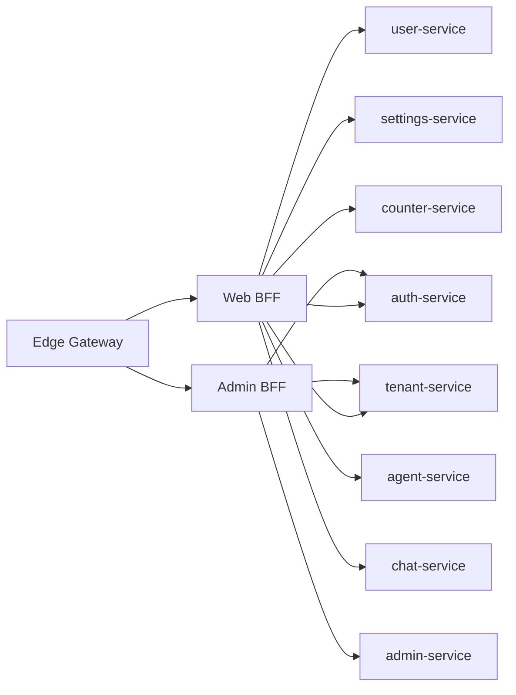
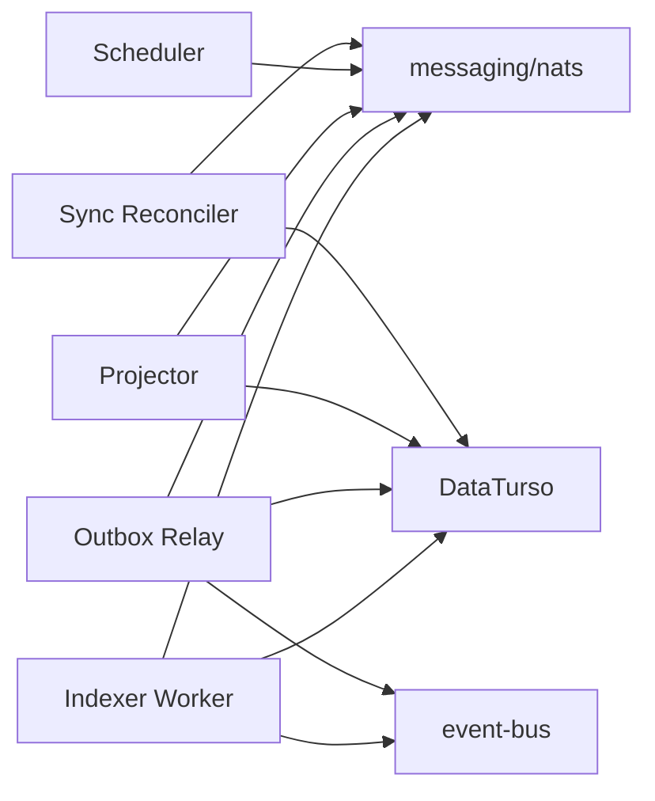
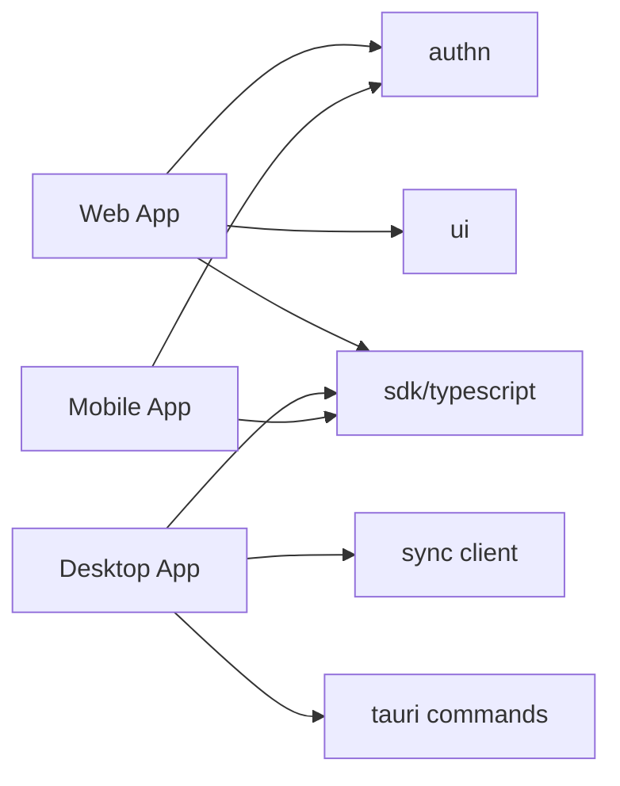
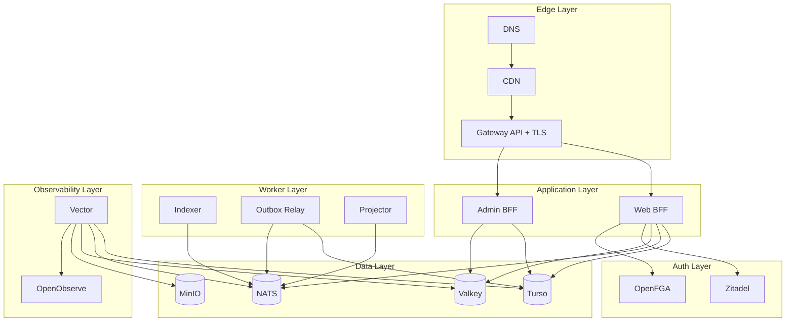

# Dependency Graphs

> Shows the dependency relationships between packages, services, and infrastructure.

## Package Dependency Layers

```
Layer 0 (Lowest - Most Stable)
├── packages/kernel/          (ids, error, money, pagination, tenancy, time)
└── packages/platform/        (config, health, buildinfo, env, release, service_meta)

Layer 1
├── packages/contracts/       (http, events, rpc, jsonschema, error-codes)
├── packages/runtime/ports/   (8 runtime abstractions)
├── packages/authn/           (oidc, pkce, session, token)
├── packages/authz/           (model, ports, caching, decision)
├── packages/data/            (turso, sqlite, migration, outbox, inbox)
├── packages/messaging/       (nats, envelope, codec)
├── packages/cache/           (api, policies)
├── packages/storage/         (api, paths, policies)
├── packages/observability/   (tracing, metrics, logging, baggage, otel)
└── packages/security/        (crypto, signing, redaction, pii)

Layer 2 (Adapters)
├── packages/runtime/adapters/memory/  (in-memory implementations)
├── packages/runtime/adapters/direct/  (direct in-process calls)
├── packages/runtime/adapters/dapr/    (Dapr sidecar adapter)
├── packages/cache/adapters/moka/      (in-memory cache)
├── packages/cache/adapters/valkey/    (distributed cache)
├── packages/storage/adapters/s3/      (S3 adapter)
├── packages/storage/adapters/minio/   (MinIO adapter)
├── packages/storage/adapters/localfs/ (local filesystem)
├── packages/authz/adapters/openfga/   (OpenFGA adapter)
└── packages/adapters/                 (legacy adapters)

Layer 3 (Services)
├── services/auth-service/
├── services/user-service/
├── services/tenant-service/
├── services/settings-service/
├── services/counter-service/
├── services/agent-service/
├── services/chat-service/
├── services/admin-service/
├── services/indexing-service/
└── services/event-bus/

Layer 4 (Servers)
├── servers/web-bff/
├── servers/admin-bff/
└── servers/edge-gateway/

Layer 5 (Workers)
├── workers/indexer/
├── workers/outbox-relay/
├── workers/projector/
├── workers/scheduler/
└── workers/sync-reconciler/

Layer 6 (Apps)
├── apps/web/
├── apps/desktop/
└── apps/mobile/
```

## Dependency Direction Rules

```
apps/*          ──▶ packages/sdk, packages/ui, packages/authn
servers/*       ──▶ services/*, packages/*
workers/*       ──▶ services/*, packages/*
services/*      ──▶ packages/kernel, packages/platform, packages/runtime/ports,
                    packages/contracts, packages/authn, packages/authz
packages/*      ──▶ Lower-layer packages only (never servers/apps/workers/services)
platform/*      ──▶ Schema, generators, validators only (no business code)
infra/*         ──▶ Not imported by any code (declarative only)
ops/*           ──▶ Not imported by any code (scripts only)
verification/*  ──▶ Can depend on everything (test code only)
```

## Service → Package Dependencies

```mermaid
graph TB
    subgraph "Auth Service"
        Auth --> Kernel
        Auth --> Platform
        Auth --> ContractAuth
        Auth --> DataTurso
        Auth --> SecurityCrypto
    end

    subgraph "User Service"
        User --> Kernel
        User --> Platform
        User --> ContractAPI
        User --> DataTurso
    end

    subgraph "Tenant Service"
        Tenant --> Kernel
        Tenant --> Platform
        Tenant --> ContractAPI
        Tenant --> DataTurso
        Tenant --> Authz
    end

    subgraph "Settings Service"
        Settings --> Kernel
        Settings --> Platform
        Settings --> DataTurso
        Settings --> SecurityRedaction
    end

    subgraph "Counter Service"
        Counter --> Kernel
        Counter --> Platform
        Counter --> ContractAPI
        Counter --> DataTurso
    end

    subgraph "Agent Service"
        Agent --> Kernel
        Agent --> Platform
        Agent --> ContractAPI
        Agent --> DataTurso
        Agent --> SecurityRedaction
    end

    subgraph "Chat Service"
        Chat --> Kernel
        Chat --> Platform
        Chat --> DataTurso
        Chat --> MessagingNATS
    end

    subgraph "Core Packages"
        Kernel[kernel]
        Platform[platform]
        ContractAPI[contracts/api]
        ContractAuth[contracts/auth]
        ContractEvents[contracts/events]
        DataTurso[data/turso]
        MessagingNATS[messaging/nats]
        Authz[authz]
        SecurityCrypto[security/crypto]
        SecurityRedaction[security/redaction]
    end
```



## Server → Service Dependencies



## Worker → Service Dependencies



## App → SDK Dependencies



## Infrastructure Dependency Graph



## Circular Dependency Check

**Status**: ✅ No circular dependencies detected

Verified by:
- `just validate-deps` — Dependency graph validator
- Platform model validator
- Cargo workspace resolver

### Rules Enforced

1. **Services cannot depend on other services** — Verified by dependency validator
2. **Services cannot depend on adapters** — Only ports are allowed
3. **Packages cannot depend on services/servers/workers** — Verified by Cargo workspace
4. **Apps cannot depend on services directly** — Only through SDK
5. **Generated directories cannot be hand-modified** — Verified by `just verify-generated`
