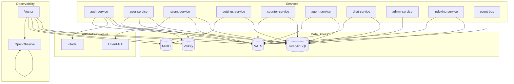

# Resource Catalog

> Auto-generated catalog of all external resources and infrastructure dependencies.

## Overview

| Resource | Type | Local Dev | Production | Status |
|----------|------|-----------|------------|--------|
| Turso/libSQL | Database | Embedded file | Turso cloud / libSQL file | ✅ Configured |
| NATS | Message Broker | Docker container | StatefulSet (3 replicas) | ✅ Configured |
| Valkey | Cache | Docker container | StatefulSet (3 replicas) | ✅ Configured |
| MinIO | Object Storage | Docker container | StatefulSet (4 replicas) | ✅ Configured |
| Zitadel | AuthN | Not started (Mock) | Zitadel deployment | ⏳ Deferred |
| OpenFGA | AuthZ | In-memory | OpenFGA deployment | ⏳ Deferred |
| Vector | Log/Metrics Collector | Not started | DaemonSet | ⏳ Deferred |
| OpenObserve | Observability | Not started | StatefulSet (2 replicas) | ⏳ Deferred |

---

## Turso/libSQL

**Type**: Database
**Path**: `packages/data/turso/`

### Description
Primary database for all service data. Supports embedded (local dev) and client/server (production) modes.

### Configuration
| Environment | Mode | Connection |
|-------------|------|------------|
| Local Dev | Embedded | `libsql://file:data.db` |
| Local Dev (full) | Client/Server | `libsql://localhost:8080` (sqld) |
| Production | Turso Cloud | `libsql://[db-name].turso.io` |

### Used By
- auth-service (sessions, tokens)
- user-service (users, profiles)
- tenant-service (tenants, members)
- settings-service (settings)
- counter-service (counters)
- agent-service (conversations, messages)
- chat-service (chats)
- admin-service (statistics)

### Migrations
- `ops/migrations/auth-service/001_create_sessions.sql`
- `ops/migrations/tenant-service/001_create_tenants.sql`

### Model
`platform/model/resources/turso.yaml`

---

## NATS

**Type**: Message Broker
**Path**: `packages/messaging/nats/`

### Description
Message broker with JetStream for reliable event publishing and consumption.

### Configuration
| Environment | Mode | Connection |
|-------------|------|------------|
| Local Dev | Docker | `nats://localhost:4222` |
| Production | StatefulSet | `nats://nats.infrastructure.svc.cluster.local:4222` |

### Features
- JetStream for persistent streams
- At-least-once delivery
- Stream consumer groups
- Message deduplication

### Used By
- All services (event publishing)
- indexer-worker (event consumption)
- outbox-relay (event publishing)
- projector (event consumption)
- sync-reconciler (event consumption)

### Model
`platform/model/resources/nats.yaml`

---

## Valkey

**Type**: Cache
**Path**: `packages/cache/adapters/valkey/`

### Description
Redis-compatible cache for session storage, rate limiting, and API caching.

### Configuration
| Environment | Mode | Connection |
|-------------|------|------------|
| Local Dev | Docker | `redis://localhost:6379` |
| Production | StatefulSet | `redis://valkey.infrastructure.svc.cluster.local:6379` |

### Used By
- auth-service (session caching)
- user-service (user profile caching)
- web-bff (API response caching)

### Features
- Persistence via RDB snapshots
- AOF (Append Only File) optional
- Memory policies (LRU, TTL)

### Model
`platform/model/resources/cache.yaml`

---

## MinIO

**Type**: Object Storage
**Path**: `packages/storage/adapters/minio/`

### Description
S3-compatible object storage for file uploads, backups, and artifacts.

### Configuration
| Environment | Mode | Connection |
|-------------|------|------------|
| Local Dev | Docker | `http://localhost:9000` |
| Production | StatefulSet | `http://minio.infrastructure.svc.cluster.local:9000` |

### Console
- Local: http://localhost:9001 (minioadmin/minioadmin)
- Production: via Gateway API

### Used By
- settings-service (settings backups)
- All services (file uploads)
- ops/backup-restore (backup storage)

### Model
`platform/model/resources/object-storage.yaml`

---

## Zitadel

**Type**: Authentication Provider (AuthN)
**Status**: ⏳ Deferred — Using MockOAuthProvider for development

### Description
Self-hosted OIDC provider for user authentication, session management, and multi-tenancy.

### Planned Configuration
| Environment | Mode | Connection |
|-------------|------|------------|
| Production | Deployment | `https://zitadel.your-domain.com` |

### Features
- OIDC/OAuth2 compliance
- Multi-tenancy support
- User management
- MFA
- Session management

### Model
`platform/model/resources/authn-zitadel.yaml`

---

## OpenFGA

**Type**: Authorization Engine (AuthZ)
**Status**: ⏳ Deferred — Using in-memory decision engine for development

### Description
Fine-grained authorization engine using relationship-based access control.

### Planned Configuration
| Environment | Mode | Connection |
|-------------|------|------------|
| Production | Deployment | `https://openfga.your-domain.com` |

### Features
- Zanzibar-inspired architecture
- Sub-millisecond decisions
- Relationship tuples
- Policy DSL

### Model
`platform/model/resources/authz-openfga.yaml`

---

## Vector

**Type**: Log/Metrics Collector
**Status**: ⏳ Deferred — Not started for local dev

### Description
High-performance data pipeline for collecting logs, metrics, and traces from all services.

### Planned Configuration
| Environment | Mode | Deployment |
|-------------|------|------------|
| Production | DaemonSet | One per node |

### Features
- High performance (Rust-based)
- Multiple sources (Docker, Kubernetes, files)
- Transform and filter
- Multiple sinks (OpenObserve, Prometheus)

### Model
`platform/model/resources/observability.yaml`

---

## OpenObserve

**Type**: Observability Platform
**Status**: ⏳ Deferred — Not started for local dev

### Description
Unified observability platform for logs, metrics, and traces.

### Planned Configuration
| Environment | Mode | Connection |
|-------------|------|------------|
| Production | StatefulSet | `https://openobserve.your-domain.com` |

### Features
- Unified logs/metrics/traces
- Prometheus compatible
- Jaeger compatible
- Dashboards and alerting

### Model
`platform/model/resources/observability.yaml`

---

## Resource Dependency Graph

